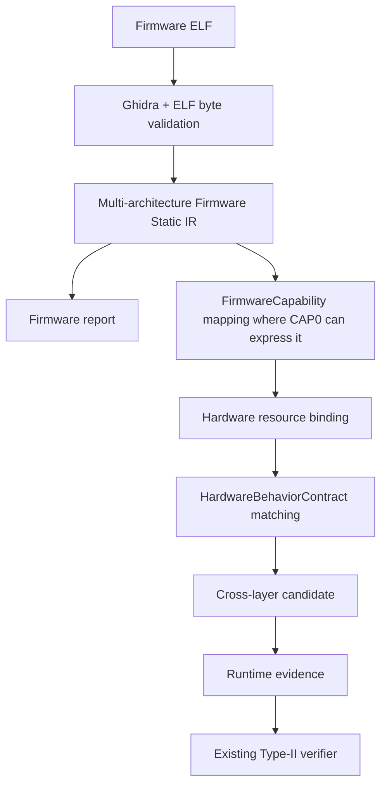

# ChipChain

ChipChain is an **evidence-driven, multi-architecture firmware–hardware cross-layer analysis framework**. The general firmware frontend supports ARM, RISC-V and PowerPC ELF static analysis. The current verified end-to-end security path focuses on controlled synthetic Ibex/RISC-V Type-II chains.

The verified Type-II runtime backend remains the **controlled synthetic Ibex MMIO experiment**. A separate ProcessorFuzz ingestion path reads an authentic hardware-team delivery ZIP. Its ELF is **hardware-supplied trigger-test firmware**, not customer or production firmware. The path parses RISC-V ELF/SI/RTL/ISA/signature evidence and reports unresolved source bindings without declaring a verified Type-II result. Neither path invokes an LLM. ARM and PowerPC do not yet have Type-II runtime verification results. This repository does not claim a physical-chip vulnerability.



The controlled Type-II demo now derives its cross-layer candidate from the General Firmware Frontend's ELF/Ghidra static capability projection. A deterministic continuity record checks each projected static capability against the reviewed frozen CAP0 runtime capabilities by ELF hash, ISA, PC, primitive, resource/address, width, known write value and instruction bytes. The frozen verifier still consumes its original runtime evidence. See the [capability mapping audit](docs/firmware-capability-mapping.md).

## What is verified


Each arrow is an evidence boundary. A candidate is not a vulnerability. A static instruction fact is not runtime execution. Execution does not establish trigger satisfaction. A satisfied trigger does not establish deviation. An observed value is not, by itself, a verified deviation. A controlled synthetic result does not establish a silicon vulnerability or external attacker control.

The verifier returns `supported`, `contradicted`, or `unknown` for the component conditions. Invalid bytes or broken identities fail closed as errors; missing evidence stays `unknown` rather than becoming a positive result. See [architecture](docs/architecture.md) and [methodology](docs/methodology.md) for the evidence gates.

## Install and quick start

Python 3.11+ is required. The Type-II replay needs only the package and deterministic dependencies. `firmware analyze` uses Ghidra 12.3 DEV and Java 25. The working installation is in `tools/ghidra/install/` locally; [pinned metadata](tools/ghidra/README.md) is tracked while the large distribution is ignored. A fresh clone must provide this distribution there or use `--ghidra-home /explicit/path`.

```bash
python3 -m venv .venv
.venv/bin/python -m pip install -e '.[test]'
.venv/bin/python -m chipchain.cli firmware analyze --elf samples/firmware/arm/sample.elf --output output/arm
.venv/bin/python -m chipchain.cli firmware analyze --elf samples/firmware/riscv/sample.elf --output output/riscv
.venv/bin/python -m chipchain.cli firmware analyze --elf samples/firmware/powerpc/sample.elf --output output/powerpc
.venv/bin/python -m chipchain.cli analyze \
  --manifest examples/type2_positive/manifest.json \
  --output output/type2-positive
.venv/bin/python -m chipchain.cli processorfuzz analyze \
  --package samples/processorfuzz/real_case_001/raw/testis.zip \
  --output output/processorfuzz-real \
  --hardware-trigger-validation
```

After installation, `chipchain analyze` is equivalent to `python -m chipchain.cli analyze`. Try the other two packaged examples:

```bash
chipchain analyze --manifest examples/type2_trigger_negative/manifest.json --output output/type2-negative
chipchain analyze --manifest examples/type2_unknown/manifest.json --output output/type2-unknown
```

`--verbose-artifacts` additionally writes selected validated contract, static, and bridge objects. Normal output contains only three files. The analysis API is read-only; CLI output is written only when the command explicitly calls the writer.
An existing nonempty output directory is rejected to protect earlier results.

`firmware analyze` actually runs project-managed Ghidra Headless, verifies every exported instruction byte against an executable ELF `PT_LOAD` mapping, and writes `firmware-analysis.json`, `firmware-summary.json`, `firmware-report.md`, and `ghidra-export.json`. An unsupported architecture/language is an explicit error; an unsupported individual instruction remains a path-independent `UNKNOWN` fact with PC, bytes and mnemonic. The three [synthetic sample ELFs](samples/firmware/README.md) and their normalized expected exports are tracked. Their exact project-local [build toolchains](tools/toolchains/README.md) and recipe are documented.

The complete reviewable results live under [artifacts/demo](artifacts/demo). Regenerate them offline from tracked exports and bytes with `PYTHONPATH=src .venv/bin/python scripts/build_demo_artifacts.py`; add `--refresh-ghidra` to rerun project Ghidra on every tracked ELF.
Rebuild the [ProcessorFuzz case artifacts](artifacts/demo/processorfuzz/real_case_001/processorfuzz-report.md) from the unchanged ZIP with `.venv/bin/python scripts/build_processorfuzz_artifacts.py --package samples/processorfuzz/real_case_001/raw/testis.zip`. The requested name `processorfuzz-case.zip` was absent when this run was made; the supplied archive is `testis.zip`, pinned by SHA256 in its [sample README](samples/processorfuzz/real_case_001/README.md).

## Inputs

`--manifest` names a JSON **artifact index**. It points to an existing `HardwareBehaviorContract`, optional state/source proof, and target and Reference run indexes. Each run index points to the canonical static catalog, runtime observations, execution bridge, platform proof, firmware capabilities, input identity, ELF bytes, raw bus/processor traces, stdout/stderr, and an optional explicit observation binding. Paths are relative to their containing index; external read-only files may also be referenced. The index is an I/O envelope, not a scientific schema or new ID recipe.

The examples include small synthetic artifacts under `examples/type2_positive/fixtures/`; the negative and unknown manifests reuse these files. Their frozen scientific identities are replayed from the included bytes. `samples/firmware/{arm,riscv,powerpc}` now contain tracked synthetic instruction-coverage samples; other real research inputs in `samples/` remain ignored. `output/` is an ignored result workspace. See [examples](examples/README.md) and [samples](samples/README.md).
The portable fixtures contain pinned source manifests and changed peripheral bytes, not the full RTL source tree or a simulator executable. They replay the frozen evidence chain; independent regeneration of source/platform attestations requires the separately retained local research workspace.

The Type-II `analyze` subcommand accepts **existing canonical runtime artifacts**; `firmware analyze` accepts a raw ELF for static analysis. `processorfuzz analyze` accepts a ZIP or directory and produces static and runtime observations, provenance conflicts, trace alignment, and a signature comparison. The `--hardware-trigger-validation` flag is an explicit intake role declaration, not a deduction from ZIP contents. The package can help ground the hardware trigger reference and evaluate evidence binding; it cannot establish that customer firmware contains the trigger. General firmware-analysis validation uses independently authored project samples. Future customer firmware must enter as a separate evidence source through the same generic firmware frontend. This ProcessorFuzz case has no verified HBC chain and its Type-II status is `NOT_ESTABLISHED`.

## Outputs and how to read them

| File | Meaning |
| --- | --- |
| `summary.json` | Compact final outcome, stage statuses, contract/result IDs, and Reference control. |
| `verification.json` | Complete canonical `Type2VerificationResult`, including per-condition evidence IDs, reason codes, and missing requirements. |
| `report.md` | Short, human-readable Chinese explanation and scope warning. |

The static frontend writes its own detailed twelve-section `firmware-report.md`. Each sample has a [tracked ARM](artifacts/demo/firmware/arm/firmware-report.md), [RISC-V](artifacts/demo/firmware/riscv/firmware-report.md), and [PowerPC](artifacts/demo/firmware/powerpc/firmware-report.md) report. Ordinary `MEMORY_LOAD`/`MEMORY_STORE` facts are retained as memory operations; MMIO counts remain zero until a typed hardware resource catalog is supplied. The [P1 cross-layer report](artifacts/demo/type2/positive/cross-layer-report.md) and [P1 verification report](artifacts/demo/type2/positive/verification-report.md) show the static candidate and runtime judgement separately.
The [real ProcessorFuzz report](artifacts/demo/processorfuzz/real_case_001/processorfuzz-report.md) distinguishes raw signature differences from a bound architectural differential and lists the rejected `disassembly.asm` and unbound `note.log`.

For the positive example, `report.md` begins:

> **结论：受控合成 Type-II 链条已验证。** 触发、偏差、客观观测和 Reference/Variant 对照均为 `supported`。Reference 的触发和预期行为成立，未观测到偏差。

`unknown` is a scientific outcome, not an execution failure. A malformed or mismatched artifact exits with code 2 and does not produce an accepted verification result. The CLI returns code 0 for a valid positive, negative, or unknown result.

## Controlled golden outcomes

| Case | Expected outcome | What it demonstrates |
| --- | --- | --- |
| P1 (`type2_positive`) | `verified_controlled_type2_chain` | A5 firmware triggers the Variant; post-update internal STATUS and bus-visible read support the controlled deviation. |
| N1 (`type2_trigger_negative`) | `trigger_contradicted` | A4 firmware executes, but its COMMAND value does not satisfy the A5 trigger. |
| N2 (P1 Reference control) | trigger and expected behavior supported; `deviation_observed=false` | The matching Reference run behaves as specified. |
| U1 (`type2_unknown`) | `unknown` | Removing the explicit observation binding prevents the final inference. |

These outcomes and their content-addressed IDs are asserted by portable tests and compared against the final research freeze. The earlier full scientific freeze passed **1528 tests, with 29 skipped**; the smaller consolidated suite is the current regression entry point.

## Repository layout

| Path | Purpose |
| --- | --- |
| `src/chipchain/firmware/` | Deterministic MMIO static grounding, execution binding, and firmware capabilities. |
| `src/chipchain/hardware/` | Typed hardware resource catalog and hardware behavior contract. |
| `src/chipchain/cross_layer/` | Exact resource binding, static candidate matching and controlled Type-II verifier. |
| `src/chipchain/workflow/`, `src/chipchain/cli.py` | Thin artifact loading, orchestration, and command-line output. |
| `examples/` | Three portable synthetic outcomes sharing small fixtures. |
| `tests/` | Identity, provenance, fail-closed, component and golden regressions. |
| `experiments/` | Frozen synthetic-source and collector material used by local historical replay. |
| `samples/firmware/{arm,riscv,powerpc}/` | Tracked synthetic source, ELF, manifest and expected static analysis. |
| `samples/processorfuzz/real_case_001/` | Immutable hardware-team ZIP and canonical expected ingestion results. |
| `artifacts/demo/` | Reviewable canonical firmware, candidate and Type-II reports. |
| `tools/ghidra/`, `tools/toolchains/`, `scripts/` | Pinned local tools, architecture-neutral exporter and build recipes. |
| `output/` | Ignored local run results. |

## Test

```bash
CHIPCHAIN_ENABLE_REAL_LLM=0 .venv/bin/pytest -q
.venv/bin/python -m pip check
.venv/bin/python -m compileall -q src tests
git diff --check
```

The portable example tests run in a fresh clone. Additional read-only regression tests replay locally frozen simulator and compatibility artifacts when those workspaces are available; otherwise they explicitly skip. Tests block network connections and external process launches by default.

## Current scope and future work

The three-architecture frontend is bounded static analysis, not a complete ISA emulator or path solver. Ghidra structure is not runtime execution; CFG reachability is not a feasible run; static ordering is not runtime ordering. The Type-II verifier is bound to the reviewed synthetic Ibex source delta, platform identities, 32-bit MMIO mapping, complete local evidence window, and controlled Reference/Variant comparison. A resource binding is not a trigger; a candidate is not a vulnerability; observed values are not automatically deviations. Normal firmware behavior is not attacker control. Type I, Type III, broad real-hardware verification and multi-ISA runtime verification remain future work.

Historical research phases and their exact implementations remain available from the repository's stable Git tags. The current mainline presents the Type-II method and runnable evidence path without requiring readers to reconstruct the development chronology.
