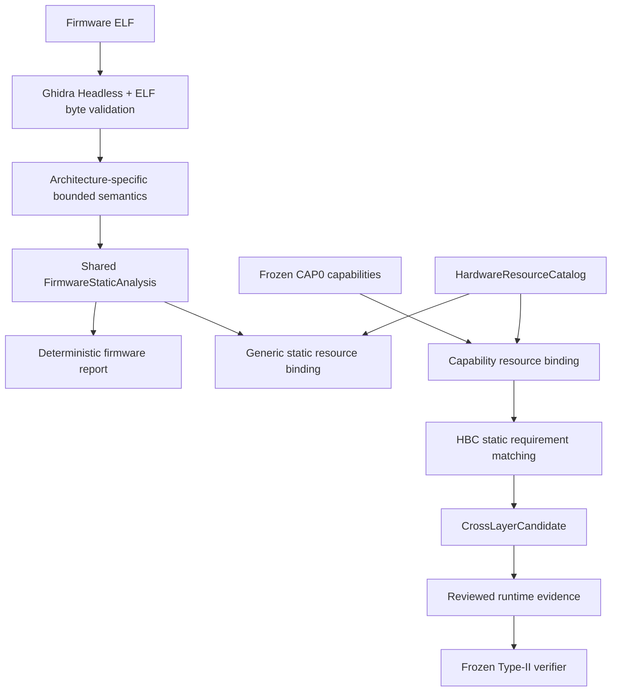
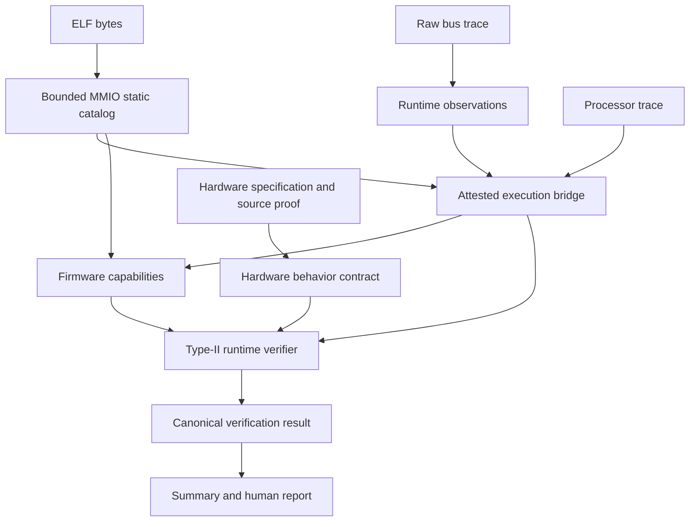

# Architecture

ChipChain now has a general ARM/RISC-V/PowerPC static firmware frontend and a separate controlled Ibex/RISC-V Type-II runtime backend. The first identifies byte-checked ELF structure and bounded instruction semantics; the second determines whether one reviewed synthetic run satisfies the hardware trigger and Reference/Variant deviation requirements.

The current Ibex demo uses frozen CAP0 MMIO facts for candidate matching, while the general frontend analyzes the same ELF separately and binds its resolved generic memory facts to the resource catalog. The two streams are explicit; no generic static fact silently replaces reviewed runtime provenance. ARM and PowerPC have static reports but no complete Type-II runtime verification.

The following diagram details the **existing controlled runtime backend**, not the full scope of the general frontend:

## Components and evidence boundaries

| Component | Main module | Responsibility |
| --- | --- | --- |
| ELF identity | `chipchain.firmware.elf` | Derive architecture, width, endianness, segments and mapped bytes from ELF; select Ghidra language explicitly. |
| Ghidra structure | `scripts/ghidra/ExportFirmwareFacts.java`, `chipchain.firmware.ghidra_normalize` | Export functions, blocks, CFG, calls and instruction bytes; reject ELF byte disagreement. |
| Static ISA/IR/report | `chipchain.firmware.semantics*`, `static_ir`, `report` | Preserve ARM, RISC-V and PowerPC behavior in one path-independent schema; expose unknowns. |
| Resource/candidate | `chipchain.hardware.resources`, `chipchain.cross_layer.resource_binding`, `matching` | Exact typed resource binding and requirement-by-requirement static candidate without runtime inference. |
| Firmware Analysis | `chipchain.firmware.mmio_grounding` | Re-extract bounded RV32 MMIO facts from ELF bytes and bind runtime trace inputs to source artifacts. Static facts alone do not prove execution. |
| Execution Grounding | `chipchain.firmware.mmio_execution_bridge` | Check processor instruction retirement and accepted/completed bus transactions against the same attested joint run. Missing joins remain unknown. |
| Firmware Capability Modeling | `chipchain.firmware.capability`, `chipchain.firmware.mmio_capability` | Represent one source PC per capability. A bound run adds explicit evidence without changing the static primitive or claiming user control. |
| Hardware Behavior Contract | `chipchain.hardware.behavior_contract` | Typed trigger, precondition, expected/deviating behavior, observation, scope and provenance. The contract is content-addressed and independently validated. |
| Runtime Trigger and Deviation Verification | `chipchain.cross_layer.type2_verifier` | Replay all supplied bytes/objects; check target scope, ordered trigger, pre-state, objective STATUS observation and Reference control. |
| Public orchestration | `chipchain.workflow.type2`, `chipchain.cli` | Resolve file indexes, call the verifier, and explicitly write compact results. No new scientific predicate or identity is defined here. |

`src/chipchain/domain/` contains small shared contracts. `cross_layer/trigger.py` and its supporting public exports remain for stable trigger/contract parsing; the older generic candidate matcher is not the controlled Type-II verifier. The compatibility module remains to replay a historically unknown result. Some old-looking relation and static-reachability models are transitive dependencies of these public exports. They are retained for import compatibility, not presented as a current end-to-end analysis path.

The previous model-agent, generic case workflow, provider integrations, EnCorpus/Heat_Press ingestion, report exporters, and phase-specific adapters were removed from current main. Their implementations remain recoverable from stable Git tags. The six frozen scientific core files remain unchanged by the general frontend.

The general analyzer selects Cortex language only when ARM ELF attributes establish Microcontroller profile; other ARM profiles are explicitly unsupported until mapped and tested. It propagates constants within one basic block and across a unique straight-line fall-through edge only. At other CFG joins it drops register knowledge. A raw load/store stays `MEMORY_LOAD`/`MEMORY_STORE`; only an exact, unique catalog binding can identify an MMIO resource. Unresolved addresses remain `UNKNOWN` bindings and overlapping resources remain `AMBIGUOUS`. An explicit manual mapping is recorded with source ID but stays `UNKNOWN` until objective identity evidence supports it; a conflict with known bytes/address is `CONTRADICTED`. Unknown instruction semantics retain PC, bytes and mnemonic. Ghidra/ELF byte equality rejects source mismatch but does not independently prove Ghidra's semantic interpretation.

CAP0 v1 is deliberately unchanged. [The mapping audit](firmware-capability-mapping.md) identifies expressible memory/MMIO/CSR/control-transfer kinds and barrier/atomic/TLB gaps. Static capability compatibility does not prove runtime trigger, pre-state, ordering, observation or deviation. Those remain exclusive to the frozen verifier.

## Artifact index and identity

The public `analyze_manifest(path)` accepts `chipchain-type2-existing-artifacts/v1`, a **file index** with exactly `schema_version`, `contract`, `state_binding`, `controlled_source`, `target_run`, and `reference_run`. Nullable entries represent absent evidence. Its target/reference run indexes name the static catalog, runtime set, bridge, platform proof, capabilities, execution inputs, ELF, raw bus/processor bytes, stdout/stderr, and optional observation binding. Paths are resolved relative to each index file and may point outside the repository. The index itself has no scientific ID.

All loaded Pydantic objects check their frozen identity. `verify_type2` replays static extraction and bridge materialization from the original bytes, then compares the provided capabilities with the regenerated set. It checks the reviewed source delta and variant patch separately. A missing explicit observation binding is `unknown`; tampered bytes or conflicting content IDs raise an error. The workflow never substitutes a label such as “P1” for evidence.

The normal writer emits `summary.json`, canonical `verification.json`, and a readable `report.md`. `--verbose-artifacts` adds selected already-validated intermediate objects. Writing is explicit; model construction and analysis do not persist files.

## Current public and historical boundaries

The controlled backend is pinned to one synthetic Ibex source delta, two firmware variants, two RTL revisions, a 32-bit MMIO map and a reviewed observation backend. It does not run Verilator or a model provider. The checked-in example bytes permit portable replay; locally ignored `output/` workspaces additionally permit read-only replay of the original collected artifacts.
The portable fixtures include pinned source manifests and changed peripheral bytes, not the entire RTL source tree or simulator executable. Full source/platform attestation must be regenerated from a separately available local collection; the packaged workflow replays its existing attested objects and identities.

The retained local historical tests check 12 bound execution joins, 12 older unknown joins and one older unknown compatibility result. These are regression boundaries, not evidence that the older generic matcher proves a Type-II chain.

Development history and exact earlier phase implementations remain on stable Git tags. Mainline repository structure follows present scientific responsibility rather than phase chronology.
