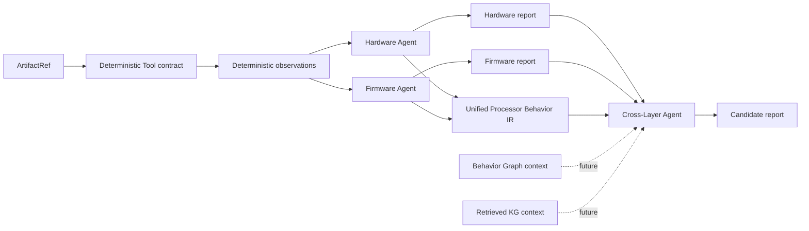
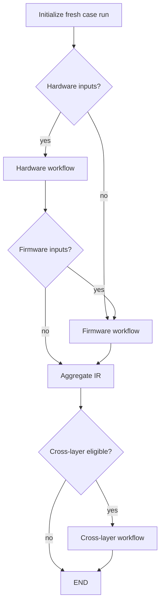

# ChipChain V3-R0-A 架构

包含冻结前补丁 **V3-R0-A.1 — Multi-Architecture Foundation Patch**，不推进到新阶段。

## 阶段与范围

R0 建立稳定、可序列化、可测试的数据合同与最小 LangGraph 编排。
输入是 synthetic artifact references；stub 不打开这些 artifact，不产生真实分析事实、
findings、漏洞或攻击链。空列表表示本阶段没有分析结果，不表示已证明安全。

项目从空仓库建立，使用 `src/` layout，无 V2 API、provider 或 testcase 兼容层。

## Case-first

`CaseBundle` 统一承载 hardware-only、firmware-only、paired 以及未来带有
confirmed-cross-layer ground-truth label 的研究案例。输入能力由两侧 artifact 列表派生，
调用方不能提交可失配的 Boolean 字段。无 artifact 的 empty case 明确拒绝；artifact ID
在整个 case 内唯一。路径仅为引用，构造/反序列化 case 不检查文件存在，也不读取文件。

`TargetDescriptor` 包含 architecture、processor ID、可选 firmware ID，以及通用 ISA variant、
字长和端序描述；这些字段不决定 workflow 分支。
`ground_truth_label` 是评测标签，任何 stub 和 routing 均不读取它来决定分析结果。
metadata/attributes 仅允许 JSON 标量映射；复杂稳定结构应成为正式字段。

## 多处理器架构基础合同

ChipChain V3 长期计划面向约 5 种 processor architectures，当前研究与样本重点为
**ARM、RISC-V、PowerPC**。其他未来架构尚未冻结，不为凑数量猜测具体架构。
`Architecture` 当前支持 `arm / riscv / powerpc / x86 / unknown`；PowerPC 是一等 family，
不映射为 UNKNOWN。UNKNOWN 表示未知信息，不是一种具体处理器架构。

统一边界为：

```text
architecture-specific artifacts/tools
→ architecture-specific deterministic analysis/extraction
→ architecture-neutral Processor Behavior IR
→ Cross-Layer Behavior Graph
→ Cross-Layer reasoning
```

ARM、RISC-V、PowerPC 共用同一 CaseBundle、Agent contracts、Case workflow、
ProcessorBehaviorIR、Cross-Layer Agent contract 和 Behavior Graph contract。
增加 Architecture enum member 不要求修改这些核心合同或 Case workflow；
后续真实分析支持需要在 extraction/analyzer 层补充能力。R0 没有 ISA-specific analysis，
也不引入按 architecture 分支的 pipeline 或 architecture plugin registry。

`TargetDescriptor` 新增字段：

| 字段 | 类型/默认值 | 语义 |
| --- | --- | --- |
| isa_variant | `str \| None`，默认 None | 开放式 variant 描述，不校验具体 ISA 名称或建立 variant enum |
| word_size_bits | 严格正整数或 None，默认 None | 仅校验整数且大于零，拒绝 Boolean、浮点和字符串，不限定特定位宽集合 |
| endianness | `Endianness`，默认 unknown | concrete target 的已知端序：little / big / unknown |

例如 synthetic PowerPC target 可描述为 `powerpc / powerpc-booke / 32 / big`。
不推断 architecture 与 variant、字长、端序之间的兼容关系，也不描述所有 bi-endian mode
switching 或执行端序转换。旧 synthetic JSON 可省略新增字段，未知信息不需要编造。
序列化默认会包含新增默认字段；需要省略时可显式使用 `exclude_unset=True`。

`ProcessorBehavior` 和 `ProcessorBehaviorIR` 不拆分为 ISA 专用类型，BehaviorKind 保持原样。
PowerPC SPR、ARM system register、RISC-V CSR 的统一 system-register abstraction 留待
V3-3 基于真实材料评估。目前可沿用 `register_access` 或现有 `csr_access` 语义类别，
本补丁不重命名 `csr_access`，也不解决 ISA 资源的语义细分。

少量 architecture-specific 数据可暂存于现有标量 `attributes`；核心跨层语义继续使用
kind、architecture、origin、evidence 等正式字段，不能全部藏入 attributes。
V3-3 将基于真实 ARM/RISC-V/PowerPC 样本评估 typed behavior payload，R0 不建立三套 metadata schema。

## 系统边界

| 层 | 责任 | R0 内容 |
| --- | --- | --- |
| Deterministic Tool | 从 artifact 提供可溯源 observation/derived result | HardwareAnalyzer/FirmwareAnalyzer Protocol、结构化 observation 合同 |
| Security Agent | 消费 observation，形成安全推理或假设 | 三个独立可实例化的确定性 stub，无 LLM 调用 |
| Processor Behavior IR | 表示两侧共享的处理器行为语义 | case ID、稳定行为 ID、kind、architecture、origin、证据、知识状态 |
| Behavior Graph | 将 case 内行为组织为关系上下文 | Protocol 和有限大小的 reference/context，无关系算法或存储 |
| Knowledge Graph | 未来检索跨案例研究知识 | Protocol 和有界 retrieved context，无全库输入或图数据库 |

依赖方向：domain → 标准库/Pydantic；tools/graphs → domain；agents → domain 与
tools/graphs contracts；workflows → agents 与 LangGraph。domain 不导入 agent、
LangGraph 或具体 analyzer/backend。三个 Agent 不调用彼此，也不共享一个总控类。



## 知识状态与研究边界

`EpistemicStatus` 表示 observed、derived、inferred、hypothesized、verified、refuted、
unknown，不是 LLM confidence 分数。

- fact：应能追溯到具体证据和适用条件；“确定性工具输出”本身不保证工具结论正确。
- observation：某个 artifact 或执行上下文中记录的现象，不自动建立因果关系。
- derived result：根据规则从输入导出的结果，不能自动扩展其适用范围。
- LLM hypothesis：未来由推理模型提出的待检验解释；R0 不生成此类内容。
- candidate：有待补全约束和证据的研究候选，不是漏洞或已验证 trigger。
- verified result：需要独立验证依据；R0 没有验证引擎，也不产出 verified 结论。

保持 `Deterministic analysis fact != LLM reasoning`、`Observation != Causality`、
`Candidate != Vulnerability`、`Candidate != Verified Trigger`、
`Static reachability != Runtime reachability`、`Correlation != Causality`。

确定性 observation 的状态限于 observed/derived/unknown。trigger hypothesis、
cross-layer candidate、attack-chain candidate、trigger feature 和 root-location candidate
仅接受 hypothesized/inferred/refuted/unknown；禁止直接标成 verified。
该限制在多架构补丁中保持不变。未来验证应采用独立结果：

```text
CrossLayerCandidate → future deterministic verification → VerificationResult
```

未来 VerificationResult 可表达 supported、refuted、inconclusive 和 missing constraints，
并关联候选与验证依据；不能把 Candidate 直接升级为 Verified Result。
本补丁只记录这一设计方向，不实现 VerificationResult 或验证流程。

这只是合同边界，不是证明系统。`ReachableBehavior.reachability_kind` 独立区分
static/runtime/unknown；epistemic status 不自动升级 reachability 类型。

Firmware 描述原固件已有行为；R0 不改写固件来构造触发路径。

## Evidence 与稳定引用

链路为 Candidate → finding ID → behavior ID → EvidenceRef → artifact ID。
EvidenceRef 保留 source type、analyzer、简单 location、summary 和知识状态；
source-map、全局 ID 注册服务、哈希去重、地址归一化均不属于 R0。
寄存器位置的 Python 字段为 `register_name`，输入也接受 `register` 别名；
`model_dump(by_alias=True)` 输出该别名，避免与 Pydantic 继承的 `register` 属性重名。
建议未来 producer 按 case/layer 命名 ID，避免聚合冲突。

输入合同检查 observation 的 case ID、ID 唯一性、行为所属侧和 evidence artifact 范围。
输出合同检查 report/IR case 一致性、finding ID 唯一性和 behavior reference 可解析性。
IR 拒绝重复 behavior ID，不静默覆盖或重命名。Cross-layer 输入复用上述检查，并校验
graph context case 和 behavior references。

独立 domain 对象允许暂存尚未装配完成的引用；没有实现所有 finding/path/anchor/candidate
之间的全局外键解析，也没有验证 evidence 的真实性。Pydantic 校验主要发生在构造、
反序列化及顶层赋值；不要使用 `model_construct`、不验证的 `model_copy(update=...)`
或原地修改嵌套列表来绕过公共合同。外部数据应使用 `model_validate`/`model_validate_json`。

## Agent 输入输出

| Agent | 输入 | 输出 |
| --- | --- | --- |
| HardwareSecurityAgent | CaseBundle + HardwareObservations | HardwareAnalysisReport + ProcessorBehaviorIR |
| FirmwareSecurityAgent | CaseBundle + FirmwareObservations | FirmwareAnalysisReport + ProcessorBehaviorIR |
| CrossLayerSecurityAgent | paired CaseBundle + 两侧 report + 统一 IR + 可选 graph/retrieved context | CrossLayerAnalysisReport |

Hardware/Firmware stub 只搬运调用者显式提供的 observation behaviors，保留原证据和知识状态；
不把 observation 自动转成 finding。默认 workflow observation node 返回空 observation batch，
并明确声明尚未分析。缺少另一侧输入不影响本侧 agent。

Graph context 的 ID 列表最多 256 项、summary 最多 8000 字符；retrieved context 的 evidence
最多 256 项。此处是最小接口限制，不表示实现了 KG、完整 Behavior Graph 或 Graph-RAG。
R0 case workflow 不检索/传送 graph context；后续可向独立 cross-layer agent 合同传入上下文。

## LangGraph workflow 与路由

四个 builder 都返回真实编译后的 `CompiledStateGraph`：

- hardware：校验 hardware-capable case → 空 deterministic observation node → hardware agent。
- firmware：校验 firmware-capable case → 空 deterministic observation node → firmware agent。
- cross-layer：eligibility node → cross-layer agent；非法输入在调用 agent 之前拒绝。
- case：initialize → conditional hardware/firmware routing → IR aggregation → eligibility →
  conditional cross-layer/END。子流程通过各自 compiled graph 的 `invoke` 组合。



**R0 cross-layer eligibility = workflow/routing eligibility**。
它不等于 sufficient vulnerability evidence、verified reachability、hardware trigger satisfaction
或 attack-chain confirmation。沿用既有 public 名称，不增加 readiness framework。

路由准入同时要求：paired artifacts、两侧 status=completed、两侧 report 存在、
统一 IR 存在、case IDs 一致，以及 report 中行为引用能解析到正确一侧的 IR 行为。
R0 允许空 report/空 IR 通过以验证生命周期；通过准入不等于具备漏洞证据。
不依赖 ground-truth label，不要求非空 finding，不推断触发可行性。

所有 workflow 使用 Pydantic `CaseWorkflowState`；LangGraph `invoke` 返回 mapping，
调用方可用 `CaseWorkflowState.model_validate(result)` 获取模型。
case workflow 每次调用从 case 重新开始，不支持复用传入 report 跳过分析或 checkpoint resume。
单侧 workflow 只运行本侧；paired 输入中的另一侧保持 pending。

## State、失败与部分结果

| Status | 含义 |
| --- | --- |
| pending | 适用但尚未执行 |
| not_applicable | case 缺少该侧输入，或单侧 case 无跨层资格 |
| completed | stub 生命周期完成，不代表真实分析、验证或安全结论 |
| failed | 执行/输出验证失败；report=None，errors 记录 stage/type/message |
| blocked | paired case 因前置报告/IR/状态不满足而未调用跨层 agent |

agent 节点在编排边界捕获 Exception 并保存结构化错误；不吞掉 KeyboardInterrupt 等
BaseException。错误不会伪装成空成功报告。Hardware 失败仍继续运行适用的 Firmware，
反之亦然；跨层被阻止。IR 聚合只表示收集到的行为，若一侧失败仍可保留另一侧行为，
报告完备性必须结合 status 判断。ID 冲突则 IR=None 并记录聚合错误。
调用独立 workflow 时缺少必需输入属于调用方合同错误，直接抛出异常。

State 保留两侧 observation batch 和 behavior list 以便节点组合；这些是工作态，
不会放入 CaseBundle。State 可以表示中间态，因此不强制所有报告和状态的静态组合约束；
workflow 负责状态转换，cross-layer gate 检查实际准入条件。

## 三类跨层问题预留

- TYPE_I：External Input → Firmware Vulnerability → affected firmware behavior → Hardware Trigger。
- TYPE_II：Normal Firmware Behavior → Hardware Trigger。
- TYPE_III：Hardware Abnormal State → Firmware-visible state → Firmware Execution Change。

只预留枚举和结构化引用；没有类型判断、因果推断、attack-chain search 或 constraint solver。

## 依赖与验证

直接依赖：Pydantic v2 用于合同与 JSON；LangChain 1.2.x 为后续模型能力保留官方接口；
LangGraph 1.0.x 用于当前真实状态图编排。pytest 是 test extra；setuptools 是构建依赖。
没有自行编写 HTTP client、provider registry、retry transport 或 structured-output parser。
LangChain 在 R0 没有模型调用点；依赖安装不等于依赖模型服务运行。

测试使用 synthetic JSON、直接构造的 observation 和可注入的 test agent，禁止网络与外部进程。
测试启动时禁用 LangSmith/LangChain tracing，并移除常见 API keys。安装依赖可使用包索引或
离线 wheelhouse；验证本身不进行网络访问。生产代码不全局修改调用者环境变量，
因此调用方不应为 R0 配置外部 tracing/callback。

## V3 non-goals 与扩展点

R0 不连接真实 LLM、QEMU、GDB/GDBFuzz、Ghidra、angr、JTAG 或真实硬件，
不解析真实 ProcessorFuzz SI，不实现 Neo4j、KG、Graph-RAG、完整 Behavior Graph、
真实 analyzer、漏洞检测、链搜索、solver、CFG、SSA 或形式验证。

后续 V3-1 ~ V3-7 可分别实现 analyzer Protocol、observation→IR mapping、agent 内的
LangChain reasoning、图后端适配和有界检索、候选生成与独立验证。
这些扩展应保留 CaseBundle、provenance 和候选/验证的边界，不能让数据集 label 驱动结论。

相对需求的小幅选择：增加公共 Contract 基类、少量 enum、结构化 TriggerConstraint，
并将 observation 合同放在 tools/contracts.py；没有扩大为 analyzer 实现。
未配置 formatter/linter，也未增加它们的依赖。没有执行 commit/push/tag。
