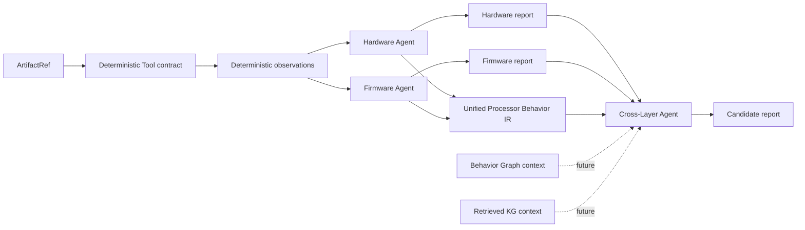
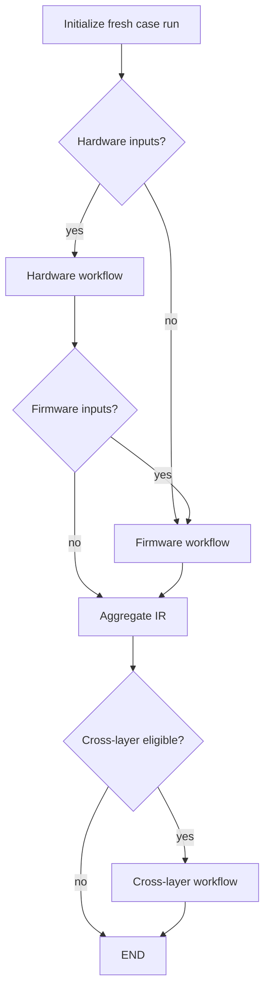

# ChipChain V3-R0 架构

稳定基线为 **V3-R0-A / V3-R0-A.1**；当前扩展为
**V3-R0-C — Case Lifecycle & Analysis Provenance**，保留 R0-B Agent infrastructure，不推进到 V3-1。
R0-B.1 仅补充依赖可复现性约束与 public import smoke test，不改变 Agent 实现。

## 阶段与范围

R0 建立稳定、可序列化、可测试的数据合同与最小 LangGraph 编排。
输入是 synthetic artifact references；stub 不打开这些 artifact，不产生真实分析事实、
findings、漏洞或攻击链。空列表表示本阶段没有分析结果，不表示已证明安全。
R0-B 增加可注入模型的领域 Agent，以离线 fake model 验证调用和 structured output。
fake 的预定义报告仅用于测试，不是真实推理结果。无模型时仍执行 R0-A stub。

项目从空仓库建立，使用 `src/` layout，无 V2 API、provider 或 testcase 兼容层。

## Case-first

`CaseBundle` 统一承载 hardware-only、firmware-only、paired 以及未来带有
confirmed-cross-layer ground-truth label 的研究案例。输入能力由两侧 artifact 列表派生，
调用方不能提交可失配的 Boolean 字段。无 artifact 的 empty case 明确拒绝；artifact ID
在整个 case 内唯一。路径仅为引用，构造/反序列化 case 不检查文件存在，也不读取文件。

`TargetDescriptor` 包含 architecture、processor ID、可选 firmware ID，以及通用 ISA variant、
字长和端序描述；这些字段不决定 workflow 分支。
`ground_truth_label` 是评测标签，任何 stub 和 routing 均不读取它来决定分析结果。
metadata/attributes 仅允许 JSON 标量映射；复杂稳定结构应成为正式字段。

## R0-C：Case lifecycle 与持久记录

长期累计 **100+ samples = evaluation dataset scale**，不是单次运行 100+ cases。
典型任务为一个 hardware 样本与一个 firmware 样本通过 paired CaseBundle 进行分析；
单侧通常也只有少量样本，典型每次执行约 1–10 个 case。这是实际工作量预期，不是 domain 硬上限。
R0-C 不面向高并发或分布式 batch。

| 合同 | 含义 | 保存内容 |
| --- | --- | --- |
| CaseBundle | 被研究的样本 | 稳定 case ID、schema version、target、artifact references、样本 metadata |
| CaseWorkflowState | 一次调用中的临时编排状态 | observation batches、节点中间结果、状态、临时 errors |
| AnalysisRun | 一次具体执行的持久记录 | UUID、case ID/schema version、UTC 时间、阶段记录、provenance、artifact identity snapshot、明确选择的 report/IR 结果 |

同一 Case 可产生 Run A/B/C，使用不同 prompt/tool/model/dependency descriptor，
并具有独立结果。动态 run 信息不回写 CaseBundle；AnalysisRun 不复制整个 CaseBundle，
也不把 LangGraph state、messages、raw response、traceback 或环境变量 dump 作为持久格式。
`analysis_run_from_state` 显式映射 final state，深拷贝结果和 provenance，后续修改 state 不影响 run。

### Case schema 与 artifact identity

`CaseBundle.schema_version` 默认且当前仅支持 `1.0`，表示 Case JSON serialization contract。
它不是 package/git/analysis version；旧 examples 省略字段仍可加载。不实现 migration framework。
`ArtifactRef.sha256` 为可选的 64 位小写十六进制字符串；不自动转小写或修复格式。
`size_bytes` 为可选严格非负整数，拒绝 Boolean、浮点和字符串。

ArtifactRef/CaseBundle validation 不访问文件系统。`tools.artifacts.fingerprint_artifact(path)`
是独立的显式本地 regular-file utility，用 1 MiB chunks 计算 SHA-256 并累计实际读取字节数。
空文件合法；missing file 抛出 FileNotFoundError，目录/URL 明确拒绝；不修改文件、不联网。
文件路径可以位于仓库外。需要 fingerprint 的调用方先显式计算，再把结果填入 artifact reference。
同一路径内容改变可产生不同哈希；不自动验证用户声明的 hash，也不提供并发写入时的一致性快照。

AnalysisRun.artifacts 只保存 artifact ID、声明的 hash/size，不重复文件内容或整个 artifact metadata。
未显式计算的 hash/size 保持 None；这表示内容身份尚未知，不表示材料已经验证。

### Run identity、时间与阶段

`AnalysisRun.run_id` 默认 UUID4；`run_case`/`run_cases` 接受 `run_id_factory` 和 `clock`，
测试可注入固定 UUID 序列与时间序列，不需要 sleep 或全局计数器。
所有 datetime 拒绝 naive 输入，其他带时区的时间统一转换成 UTC，JSON 使用标准 ISO 8601。
run finished_at 不得早于 started_at；terminal run 要有 finish time。

原 `AnalysisStatus` 和 `WorkflowStage` 移至 domain/common.py，并在 workflows/state.py 保留原导入入口；
`RunStatus` 是同一个 AnalysisStatus 的别名，没有第二套状态系统。
阶段沿用 `hardware / firmware / ir_aggregation / cross_layer`；保留原 `ir_aggregation` 字符串，
它对应本阶段要求中的 behavior IR aggregation，不做无意义 rename。

`RunStageRecord` 保存 stage、status、可选 started_at/finished_at/failure。
当前 final state 没有逐阶段 timing events，因此 mapper 保留阶段时间 None，不伪造为整个 run 时长。
阶段完成须存在对应结果；failed/not_applicable/blocked 不伪装为成功报告。
整体有失败则 failed；无失败但前置不满足则 blocked；成功和不适用阶段组成 completed run。
completed 仍只表示执行完成，不代表漏洞确认或安全证明。

### 结构化失败与隔离

`RunFailure` 包含 category、可选 stage、固定 public message 和可选 exception type。
category 仅区分 input_validation、deterministic_analysis、agent_execution、structured_output、workflow_internal。
已有 AgentExecutionError/AgentStructuredOutputError 映射到对应类别；ValidationError 可识别为输入校验失败，
其他未分类错误归 workflow_internal。未来 deterministic analyzer 可使用已预留 category，当前没有真实 analyzer。

mapper 不复制 WorkflowError.message 或 exception 字符串，避免将原始 provider response、secret 或 traceback
带入 run failure。固定公开消息会损失细节，这是有意的持久化边界；它不是所有报告文本的通用脱敏器。
描述符及报告内容仍要求调用方只提供允许持久保存的信息。

如果 workflow 在返回 final state 前直接抛错，run 记录顶层 failure（stage=None），
适用阶段标 blocked，不虚构阶段执行结果；此时无法从现有接口恢复中途的部分结果。
若已有完整失败 state，则保留成功侧结果和对应失败阶段。非法输入产生独立失败 run，后续 case 继续。
run API 接受 CaseBundle，不接收任意原始 JSON；完全不可用的 case ID 或非法 clock/UUID factory
属于调用方配置错误，不能保证可形成合法 run。

### Execution provenance

`RunProvenance` 记录 ChipChain package/version、Python version、OS/architecture platform、
关键 dependency versions、prompt/model/tool descriptors。使用 importlib.metadata 与 platform 的
Python APIs；不调用 subprocess/pip freeze，不读取环境变量或模型配置。
关键包包括 pydantic、langchain、langchain-core、langgraph、langgraph-prebuilt；
distribution 未安装时该版本明确记为 None，不阻止创建 run。

三份 prompt module 各增加稳定 `PROMPT_DESCRIPTOR`：
hardware-security-agent/v1、firmware-security-agent/v1、cross-layer-security-agent/v1。
每个 descriptor 包含 agent_role、prompt_id、prompt_version，run 不复制完整 prompt 文本。
没有 registry；system prompt 语义和 Agent 调用机制均不改变。

ModelDescriptor 包含 agent_role、model_identifier、可选 provider_identifier、mode；
使用 fake/stub/unknown 等中性描述，不依赖 LangChain domain 类型，不保存凭据。
ToolDescriptor 包含 tool_name、可选 tool_version、tool_role、可选 configuration_sha256；
采用配置 fingerprint 而非任意原始 configuration metadata，避免无意保存认证配置。
该合同也从 tools/contracts.py 导出，没有增加实际工具实现。

`capture_provenance(prompts=..., models=..., tools=...)` 接受调用方明确选择的描述符，
未提供的 model role 补 unknown。默认 `run_case` 使用已知 stub workflow，记录三 stub model descriptors
与两个 observation-stub tool descriptors，prompt 列表为空（stub 没有执行 prompt）。
注入自定义 workflow 时，必须显式提供 provenance 才能记录准确组件；否则 model 记 unknown，
prompt/tool 保持空列表，不猜测模型身份或扫描 graph。描述符表示配置；stage records 表示实际执行情况。

### Small-set convenience 与序列化

`execution.run_case` 复用现有单 case workflow，创建独立 AnalysisRun；不改变 graph routing。
`run_cases` 是小集合顺序执行 convenience，仅顺序复用同一 compiled workflow，
接收 `Sequence[CaseBundle]`、返回同长度 run list，不设 case 数量硬上限。
典型 ChipChain 工作量为每次执行约 1–10 个 case，这是 operational expectation，不是 hard domain limit。
每个 case 独立 ID，单个分析失败后继续下一项；空集合返回空列表。
不建立 CaseBatch、BatchRun、scheduler、worker、retry queue、数据库或并行执行。

AnalysisRun 支持 `model_dump(mode="json")` 和 JSON round-trip。R0-C 不增加自动 writer：
Case 构造、workflow 和 run helper 均不隐式写文件，保存由调用方显式触发。
ground_truth_label 不进入 Agent context、run provenance 或 run 结果，不影响路由和候选；
测试用固定 ID/clock 对比更改 label 前后的整个 run 与各模型输入消息。

### 样本与输出工作区

根目录的 `samples/hardware/` 和 `samples/firmware/` 放真实研究输入；
`examples/` 与 `tests/` 只放 synthetic examples/test data。建议真实样本使用 hw-case-001/、
fw-case-001/ 等子目录，不固定具体文件布局，也不实现 ELF/SI/trace/GDBFuzz/Ghidra 等 parser。
paired CaseBundle 同时引用两侧文件，不要求 `samples/cross_layer/`，不复制 artifact 来配对。

未来持久化结果统一使用 `output/`，推荐 `<case_id>/<run_id>/`，逐步保存 run JSON、报告、IR
及后续 graph/verification/evaluation artifacts。调用方负责把任意 case ID 安全映射为目录名。
domain 不依赖这个相对路径；workspace convention != domain validation rule，外部只读路径始终可引用。

`.gitignore` 默认忽略三个工作区中的实际文件和子目录，保留根 README.md/.gitkeep；
本阶段每个目录使用 README 占位即可。未放入真实样本或 runtime output，也不影响 examples/tests。

### R0 freeze boundary

R0-C 完成即 Architecture Reset complete，后续阶段为 **V3-1 Hardware Security Agent**。
本轮在此停止，不实现 V3-1，不规划 R0-D/R0-E 等新通用基础阶段；
只有后续真实材料暴露 blocking flaw 时才考虑必要的基础合同修正。

## 多处理器架构基础合同

ChipChain V3 长期计划面向约 5 种 processor architectures，当前研究与样本重点为
**ARM、RISC-V、PowerPC**。其他未来架构尚未冻结，不为凑数量猜测具体架构。
`Architecture` 当前支持 `arm / riscv / powerpc / x86 / unknown`；PowerPC 是一等 family，
不映射为 UNKNOWN。UNKNOWN 表示未知信息，不是一种具体处理器架构。

统一边界为：

```text
architecture-specific artifacts/tools
→ architecture-specific deterministic analysis/extraction
→ architecture-neutral Processor Behavior IR
→ Cross-Layer Behavior Graph
→ Cross-Layer reasoning
```

ARM、RISC-V、PowerPC 共用同一 CaseBundle、Agent contracts、Case workflow、
ProcessorBehaviorIR、Cross-Layer Agent contract 和 Behavior Graph contract。
增加 Architecture enum member 不要求修改这些核心合同或 Case workflow；
后续真实分析支持需要在 extraction/analyzer 层补充能力。R0 没有 ISA-specific analysis，
也不引入按 architecture 分支的 pipeline 或 architecture plugin registry。

`TargetDescriptor` 新增字段：

| 字段 | 类型/默认值 | 语义 |
| --- | --- | --- |
| isa_variant | `str \| None`，默认 None | 开放式 variant 描述，不校验具体 ISA 名称或建立 variant enum |
| word_size_bits | 严格正整数或 None，默认 None | 仅校验整数且大于零，拒绝 Boolean、浮点和字符串，不限定特定位宽集合 |
| endianness | `Endianness`，默认 unknown | concrete target 的已知端序：little / big / unknown |

例如 synthetic PowerPC target 可描述为 `powerpc / powerpc-booke / 32 / big`。
不推断 architecture 与 variant、字长、端序之间的兼容关系，也不描述所有 bi-endian mode
switching 或执行端序转换。旧 synthetic JSON 可省略新增字段，未知信息不需要编造。
序列化默认会包含新增默认字段；需要省略时可显式使用 `exclude_unset=True`。

`ProcessorBehavior` 和 `ProcessorBehaviorIR` 不拆分为 ISA 专用类型，BehaviorKind 保持原样。
PowerPC SPR、ARM system register、RISC-V CSR 的统一 system-register abstraction 留待
V3-3 基于真实材料评估。目前可沿用 `register_access` 或现有 `csr_access` 语义类别，
本补丁不重命名 `csr_access`，也不解决 ISA 资源的语义细分。

少量 architecture-specific 数据可暂存于现有标量 `attributes`；核心跨层语义继续使用
kind、architecture、origin、evidence 等正式字段，不能全部藏入 attributes。
V3-3 将基于真实 ARM/RISC-V/PowerPC 样本评估 typed behavior payload，R0 不建立三套 metadata schema。

## 系统边界

| 层 | 责任 | R0 内容 |
| --- | --- | --- |
| Deterministic Tool | 从 artifact 提供可溯源 observation/derived result | HardwareAnalyzer/FirmwareAnalyzer Protocol、结构化 observation 合同 |
| Security Agent | 消费 observation，形成安全推理或假设 | 三个独立 Agent，支持注入 LangChain 模型；保留默认 stub，测试仅使用离线 fake |
| Processor Behavior IR | 表示两侧共享的处理器行为语义 | case ID、稳定行为 ID、kind、architecture、origin、证据、知识状态 |
| Behavior Graph | 将 case 内行为组织为关系上下文 | Protocol 和有限大小的 reference/context，无关系算法或存储 |
| Knowledge Graph | 未来检索跨案例研究知识 | Protocol 和有界 retrieved context，无全库输入或图数据库 |

依赖方向：domain → 标准库/Pydantic；tools/graphs → domain；agents → domain 与
tools/graphs contracts 及 Agent/runtime 内的 LangChain；workflows → agents 与 LangGraph。domain 不导入 agent、
LangGraph 或具体 analyzer/backend。三个 Agent 不调用彼此，也不共享一个总控类。



## 知识状态与研究边界

`EpistemicStatus` 表示 observed、derived、inferred、hypothesized、verified、refuted、
unknown，不是 LLM confidence 分数。

- fact：应能追溯到具体证据和适用条件；“确定性工具输出”本身不保证工具结论正确。
- observation：某个 artifact 或执行上下文中记录的现象，不自动建立因果关系。
- derived result：根据规则从输入导出的结果，不能自动扩展其适用范围。
- LLM hypothesis：由推理模型提出的待检验解释；R0-B 仅测试预定义 synthetic hypothesis 的传递和约束。
- candidate：有待补全约束和证据的研究候选，不是漏洞或已验证 trigger。
- verified result：需要独立验证依据；R0 没有验证引擎，也不产出 verified 结论。

保持 `Deterministic analysis fact != LLM reasoning`、`Observation != Causality`、
`Candidate != Vulnerability`、`Candidate != Verified Trigger`、
`Static reachability != Runtime reachability`、`Correlation != Causality`。

确定性 observation 的状态限于 observed/derived/unknown。trigger hypothesis、
cross-layer candidate、attack-chain candidate、trigger feature 和 root-location candidate
仅接受 hypothesized/inferred/refuted/unknown；禁止直接标成 verified。
该限制在多架构补丁中保持不变。未来验证应采用独立结果：

```text
CrossLayerCandidate → future deterministic verification → VerificationResult
```

未来 VerificationResult 可表达 supported、refuted、inconclusive 和 missing constraints，
并关联候选与验证依据；不能把 Candidate 直接升级为 Verified Result。
本补丁只记录这一设计方向，不实现 VerificationResult 或验证流程。

这只是合同边界，不是证明系统。`ReachableBehavior.reachability_kind` 独立区分
static/runtime/unknown；epistemic status 不自动升级 reachability 类型。

Firmware 描述原固件已有行为；R0 不改写固件来构造触发路径。

## Evidence 与稳定引用

链路为 Candidate → finding ID → behavior ID → EvidenceRef → artifact ID。
EvidenceRef 保留 source type、analyzer、简单 location、summary 和知识状态；
source-map、全局 ID 注册服务、哈希去重、地址归一化均不属于 R0。
寄存器位置的 Python 字段为 `register_name`，输入也接受 `register` 别名；
`model_dump(by_alias=True)` 输出该别名，避免与 Pydantic 继承的 `register` 属性重名。
建议未来 producer 按 case/layer 命名 ID，避免聚合冲突。

输入合同检查 observation 的 case ID、ID 唯一性、行为所属侧和 evidence artifact 范围。
输出合同检查 report/IR case 一致性、finding ID 唯一性和 behavior reference 可解析性。
IR 拒绝重复 behavior ID，不静默覆盖或重命名。Cross-layer 输入复用上述检查，并校验
graph context case 和 behavior references。

独立 domain 对象允许暂存尚未装配完成的引用；没有实现所有 finding/path/anchor/candidate
之间的全局外键解析，也没有验证 evidence 的真实性。Pydantic 校验主要发生在构造、
反序列化及顶层赋值；不要使用 `model_construct`、不验证的 `model_copy(update=...)`
或原地修改嵌套列表来绕过公共合同。外部数据应使用 `model_validate`/`model_validate_json`。

## Agent 输入输出

| Agent | 输入 | 输出 |
| --- | --- | --- |
| HardwareSecurityAgent | CaseBundle + HardwareObservations | HardwareAnalysisReport + ProcessorBehaviorIR |
| FirmwareSecurityAgent | CaseBundle + FirmwareObservations | FirmwareAnalysisReport + ProcessorBehaviorIR |
| CrossLayerSecurityAgent | paired CaseBundle + 两侧 report + 统一 IR + 可选 graph/retrieved context | CrossLayerAnalysisReport |

Hardware/Firmware stub 只搬运调用者显式提供的 observation behaviors，保留原证据和知识状态；
不把 observation 自动转成 finding。默认 workflow observation node 返回空 observation batch，
并明确声明尚未分析。缺少另一侧输入不影响本侧 agent。

Graph context 的 ID 列表最多 256 项、summary 最多 8000 字符；retrieved context 的 evidence
最多 256 项。此处是最小接口限制，不表示实现了 KG、完整 Behavior Graph 或 Graph-RAG。
R0 case workflow 不检索/传送 graph context；后续可向独立 cross-layer agent 合同传入上下文。

## R0-B：Security Agent 与 Model 的边界

**Security Agent != Model**。三个领域 Agent 各自保留输入合同、职责、prompt、context
construction 和输出装配；ChatModel 是显式注入的调用依赖，不是领域 Agent 的别名。

| ChipChain owns | LangChain owns |
| --- | --- |
| domain semantics、agent responsibility、prompt constraints | model abstraction、agent/model invocation |
| context construction、Pydantic contracts、report/IR assembly | structured output integration、provider interoperability |

构造方式为 `HardwareSecurityAgent(model=...)`、`FirmwareSecurityAgent(model=...)`、
`CrossLayerSecurityAgent(model=...)`。每个实例可使用不同模型，不存在选择策略、registry、
fallback 或硬编码 provider。无参构造保留稳定基线 stub，原有测试和 workflow 默认行为不变。
生产代码不读取 API key，不在 import 时实例化模型，也不替调用方安装 provider adapter。

### 实际 API 审核与选择

R0-B 的当前机制是 `with_structured_output`，适合三 Agent 的单次结构化报告生成。
它是正式运行路径，不是依赖临时 workaround 的替代实现。使用的 public API 为：

- `langchain_core.language_models.BaseChatModel`：注入抽象。
- `BaseChatModel.with_structured_output(PydanticReport, include_raw=True)`：官方 structured-output Runnable。
- `Runnable.invoke`：传入 `SystemMessage` 和 `HumanMessage`。
- `langchain_core.messages.SystemMessage/HumanMessage/AIMessage`：仅存在于 Agent/runtime 与 tests 边界。

当前通用实现通过 `bind_tools` 和官方 `PydanticToolsParser` 校验 schema；生产 helper
不自建 parser，不抽取 JSON、不剥离 markdown、不修复响应、不重试。
这里只需要单次报告生成，因此不引入额外 agent loop；外层仍使用已有 LangGraph 编排。
`create_agent` 不属于当前生产 runtime 的需求；R0-B.1 已验证其基础导入成功。
未来领域 Agent 需要 active tool orchestration 时可单独评估，不因依赖补丁迁移当前机制。

### R0-B.1 supported dependency baseline

在 Python 3.12.13 环境中，修改前后的实际版本如下：

| Package | Before | Verified after（fresh 与现有环境） |
| --- | --- | --- |
| langchain | 1.2.10 | 1.2.10 |
| langchain-core | 1.6.2 | 1.6.2 |
| langgraph | 1.0.10 | 1.0.10 |
| langgraph-prebuilt | 1.0.13 | 1.0.8 |
| langgraph-checkpoint | 4.2.0 | 4.2.0 |
| langgraph-sdk | 0.3.15 | 0.3.15 |
| pydantic | 2.13.4 | 2.13.4 |
| pytest | 9.1.1 | 9.1.1 |

旧项目约束为 `pydantic>=2.7,<3`、`langchain>=1.2,<1.3`、`langgraph>=1.0,<1.1`。
实际 LangChain 1.2.10 元数据要求 `langgraph>=1.0.8,<1.1.0`；LangGraph 1.0.10 要求
`langgraph-prebuilt>=1.0.8,<1.1.0`，因而允许 prebuilt 1.0.13。
后者元数据只要求 `langchain-core>=1.3.1` 和 checkpoint 范围，未表达其对新版 Graph runtime
的要求。导入 `langchain.agents.create_agent` 时，prebuilt/tool_node.py 访问
`langgraph.runtime.ExecutionInfo`，在 Graph 1.0.10 上产生 `ImportError`。
`BaseChatModel`/`StateGraph` imports 和 `pip check` 均通过，无法单独揭示这一错误。

修复后的 pyproject 约束：

```text
pydantic>=2.7,<3
langchain>=1.2.10,<1.3
langgraph>=1.0.10,<1.1
langgraph-prebuilt>=1.0.8,<1.0.9
```

保留已验证的 LangChain/Graph 系列，提高下界到实际基线，不追逐新 minor。
prebuilt 1.0.8 是 Graph 1.0.10 元数据声明的最低 bundled 版本，其 wheel 不引用缺失的
ExecutionInfo，且已通过完整运行时验证。采用保守的 1.0.8 release-line 范围，
不声称未测试的 1.0.9–1.0.12 一定不兼容，也不把所有传递依赖锁死为 exact version。

**ChipChain 不导入、不使用 langgraph-prebuilt APIs。** 它仍由 LangGraph 使用。
但打包元数据确实新增一条直接 requirement，作用仅为限制这个传递组件的兼容范围：
当前 Graph 的元数据上界不足以阻止已知错误，而外置 constraints 文件不会随普通项目安装
自动生效。将 guard 放进 pyproject 才能让正常安装 resolver 执行限制；没有 compatibility shim。
因此“没有 prebuilt API 依赖”不等于“pyproject 没有 prebuilt requirement”。

### Fresh installation 与回归规则

R0-B.1 使用未继承现有 site-packages 的 `/tmp` Python 3.12 virtual environment，
仅从 pyproject 安装项目和 test extra，未传入额外版本 constraints。
本地 pip cache 提供其他依赖；只联网下载缺失的 prebuilt 1.0.8 wheel 以准备安装。
随后安装（含隔离构建依赖）通过 `--no-index --find-links` 完成，smoke imports 和全部 pytest
完全离线。wheelhouse 同时包含已知有问题的 prebuilt 1.0.13，resolver 仍选择受约束的 1.0.8。

正常安装命令：

```bash
python3.12 -m venv /tmp/chipchain-r0b1-fresh
source /tmp/chipchain-r0b1-fresh/bin/activate
python -m pip install -e '.[test]'
python -c 'import langchain, langgraph; from langchain_core.language_models import BaseChatModel; from langgraph.graph import StateGraph; from langchain.agents import create_agent'
pytest -q
python -m pip check
python -m compileall -q src tests
```

离线安装可给 pip 增加 `--no-index --find-links /path/to/wheels`；wheelhouse 需包含项目及
隔离构建的全部依赖（含 setuptools）。现有 `.venv` 未删除或重建；fresh 验证通过后，
通过相同项目约束正常同步，已安装运行依赖仅 prebuilt 从 1.0.13 调整为 1.0.8。

新增 `tests/unit/test_dependency_compatibility.py`，仅检查稳定 public imports，
不检查 private API、不断言版本号、不调用模型。原 97 项测试继续覆盖官方
`with_structured_output` + offline fake + Pydantic + LangGraph 路径。
已验证强制安装 `langgraph-prebuilt==1.0.13` 与项目时 resolver 返回 `ResolutionImpossible`。

该范围排除已知不兼容组合，但不是所有未来传递依赖版本的兼容证明或完整 lockfile。
后续扩展范围需重复 fresh install、public imports、完整 pytest 和 pip check；
当前验证范围为 Python 3.12/Linux，不声称已经验证所有 Python/平台组合。

### Structured report 与 IR

三个模型的 schema 分别是 HardwareAnalysisReport、FirmwareAnalysisReport、
CrossLayerAnalysisReport。官方 parser 产生 Pydantic report 后，薄 runtime 再从数据重新校验，
避免未验证构造或嵌套修改的 model instance 绕过合同；随后装配原有 AgentOutput。
缺失 structured response、解析失败、非法字段以及多个含糊的 tool calls 均失败，不自动补造报告。

Hardware/Firmware 的 IR 完全由输入 observation behaviors 组装，模型只引用这些 ID；
报告与 IR 的 case、引用和来源侧由原有 Output validator 检查。模型不能生成整个 IR。
Cross-layer 报告额外检查 case_id 与调用输入相同。所有原有 public domain/Agent 合同均未修改。

未来以下两类行为可以共存，但必须保留 provenance 和不同知识状态：

```text
deterministic analyzers → ProcessorBehaviorIR
LLM inferred behavior → ProcessorBehaviorIR (epistemic_status = inferred/hypothesized)
```

R0-B 不实现后一条行为生成路径，更不是 `Raw ELF → LLM → entire ProcessorBehaviorIR`。
Pydantic 校验不等于事实真实性或因果验证；现有 candidate/hypothesis 的 verified 禁令仍有效，
其他语义真实性依赖证据与未来验证。没有扩大为通用外键/证据验证系统。

### Prompts

`agents/prompts/` 分开保存三份 system prompt，无模板框架。Hardware 强调 observation、
证据、trigger hypothesis 与 abnormal state，不允许编造 trace、寄存器值或已验证 trigger。
Firmware 只推理 original firmware behavior，不允许假定改写固件、注入新代码或把静态可达性
等同运行时可达性。Cross-layer 消费报告/IR/有界 graph context，评估路径与触发条件、
异常状态与固件执行变化；证据不足应返回 missing constraints 和 unresolved questions。
所有 prompt 将输入描述为分析数据，而非可覆盖系统职责的指令。

### 精确上下文边界

模型收到一条领域 SystemMessage 和一条 JSON HumanMessage：

| Agent | JSON 内容 |
| --- | --- |
| Hardware / Firmware | case_id、name、target、可选 Boolean synthetic 标记；仅本侧 artifact 的 ID/type/path/format；本侧 observation batch 中 observations（含 summary、EvidenceRefs、behaviors、知识状态）及 unresolved_questions |
| Cross-layer | 相同 case identity；两侧完整结构化 report；统一 IR；已提供的 bounded BehaviorGraphContext / RetrievedKnowledgeContext |

不发送 ground_truth_label、任意 case/artifact metadata、另一侧 artifact 列表、workflow errors
或 debug state；可选 None 字段递归省略。case metadata 仅提取 Boolean `synthetic`。
ProcessorBehavior attributes 和证据位置保留为领域数据。artifact path 仅作 provenance，
无文件读取、binary 内容、全知识库或自动检索。

`agents/context.py` 显式投影字段并使用 Pydantic JSON 序列化。
Hardware/Firmware 的 artifacts、observations、unresolved_questions 每项顶层列表最多 128 项；
所有 Agent 最终 JSON 最多 **64,000 字符**，包括嵌套 evidence/behaviors/reports。
已有 graph context 的局部数量/长度约束仍有效。超限在模型调用前拒绝，不静默截断或破坏引用。
总字符上限是在序列化后检查，并非内存上限或 token-budget optimizer。

### 错误与 workflow 集成

`AgentExecutionError` 表示模型 setup/invocation 或 context 构造失败；
其子类 `AgentStructuredOutputError` 表示 structured response 或 AgentOutput 验证失败。
捕获原异常时保留 `raise ... from exc`，公开错误消息不复制模型响应或 provider exception 文本。
原始异常链保留给调试，因此调用方不能把完整 traceback 当作已经脱敏的日志。
无重试、backoff、response repair、fallback 或记忆。

四个现有 workflow builder 已支持 Agent 注入，无需修改 graph logic。
hardware-only/firmware-only 仅调用对应模型，paired 顺序调用三者。
调用错误由已有 workflow 转为 failed 和结构化 errors；前置侧失败时跨层 blocked，另一侧继续。
模型不支持 structured output 时在显式构造 Agent 时失败，此时尚未进入 workflow。

### 离线 fake 与测试

检查发现官方 FakeListChatModel 和 GenericFakeChatModel 均未实现 bind_tools。
`tests/fakes.py` 因而只为官方 GenericFakeChatModel 补充最小 test-only tool binding、
消息记录和错误注入；响应是预定义 AIMessage tool calls。没有覆盖 with_structured_output，
所以测试实际经过 LangChain 官方 parser 和 Pydantic，不是直接返回报告的 mock。
测试 fake 不进入生产 package。

测试继续阻止 network 和外部 subprocess，禁用 tracing，移除常见 API key（含 QWEN_API_KEY）。
额外测试在 guard 后设置 synthetic OPENAI/ANTHROPIC/QWEN key，再执行三种 routing，
确认显式 fake model 完成调用且没有自动发现/使用环境中的 provider 凭据。

## LangGraph workflow 与路由

四个 builder 都返回真实编译后的 `CompiledStateGraph`：

- hardware：校验 hardware-capable case → 空 deterministic observation node → hardware agent。
- firmware：校验 firmware-capable case → 空 deterministic observation node → firmware agent。
- cross-layer：eligibility node → cross-layer agent；非法输入在调用 agent 之前拒绝。
- case：initialize → conditional hardware/firmware routing → IR aggregation → eligibility →
  conditional cross-layer/END。子流程通过各自 compiled graph 的 `invoke` 组合。



**R0 cross-layer eligibility = workflow/routing eligibility**。
它不等于 sufficient vulnerability evidence、verified reachability、hardware trigger satisfaction
或 attack-chain confirmation。沿用既有 public 名称，不增加 readiness framework。

路由准入同时要求：paired artifacts、两侧 status=completed、两侧 report 存在、
统一 IR 存在、case IDs 一致，以及 report 中行为引用能解析到正确一侧的 IR 行为。
R0 允许空 report/空 IR 通过以验证生命周期；通过准入不等于具备漏洞证据。
不依赖 ground-truth label，不要求非空 finding，不推断触发可行性。

所有 workflow 使用 Pydantic `CaseWorkflowState`；LangGraph `invoke` 返回 mapping，
调用方可用 `CaseWorkflowState.model_validate(result)` 获取模型。
case workflow 每次调用从 case 重新开始，不支持复用传入 report 跳过分析或 checkpoint resume。
单侧 workflow 只运行本侧；paired 输入中的另一侧保持 pending。

## State、失败与部分结果

| Status | 含义 |
| --- | --- |
| pending | 适用但尚未执行 |
| not_applicable | case 缺少该侧输入，或单侧 case 无跨层资格 |
| completed | Agent 生命周期完成（stub 或注入模型），不代表真实分析、验证或安全结论 |
| failed | 执行/输出验证失败；report=None，errors 记录 stage/type/message |
| blocked | paired case 因前置报告/IR/状态不满足而未调用跨层 agent |

agent 节点在编排边界捕获 Exception 并保存结构化错误；不吞掉 KeyboardInterrupt 等
BaseException。错误不会伪装成空成功报告。Hardware 失败仍继续运行适用的 Firmware，
反之亦然；跨层被阻止。IR 聚合只表示收集到的行为，若一侧失败仍可保留另一侧行为，
报告完备性必须结合 status 判断。ID 冲突则 IR=None 并记录聚合错误。
调用独立 workflow 时缺少必需输入属于调用方合同错误，直接抛出异常。

State 保留两侧 observation batch 和 behavior list 以便节点组合；这些是工作态，
不会放入 CaseBundle。State 可以表示中间态，因此不强制所有报告和状态的静态组合约束；
workflow 负责状态转换，cross-layer gate 检查实际准入条件。

## 三类跨层问题预留

- TYPE_I：External Input → Firmware Vulnerability → affected firmware behavior → Hardware Trigger。
- TYPE_II：Normal Firmware Behavior → Hardware Trigger。
- TYPE_III：Hardware Abnormal State → Firmware-visible state → Firmware Execution Change。

只预留枚举和结构化引用；没有类型判断、因果推断、attack-chain search 或 constraint solver。

## 依赖与验证

直接依赖：Pydantic v2 用于合同与 JSON；LangChain 1.2.x 提供模型与 structured-output 官方接口；
LangGraph 1.0.x 用于当前真实状态图编排。pytest 是 test extra；setuptools 是构建依赖。
没有自行编写 HTTP client、provider registry、retry transport 或 structured-output parser。
R0-B 已有注入式调用点，但默认 stub 与所有测试均不依赖模型服务。
R0-B 未新增 provider package；R0-B.1 仅在 pyproject 增加既有 bundled prebuilt 的兼容 guard，
并正常调整已安装的 prebuilt 版本；不引入真实 provider 或新的生产 API 依赖。

测试使用 synthetic JSON、直接构造的 observation 和可注入的 test agent，禁止网络与外部进程。
测试启动时禁用 LangSmith/LangChain tracing，并移除常见 API keys。安装依赖可使用包索引或
离线 wheelhouse；验证本身不进行网络访问。生产代码不全局修改调用者环境变量，
因此调用方不应为 R0 配置外部 tracing/callback。

## V3 non-goals 与扩展点

R0 不连接真实 LLM、QEMU、GDB/GDBFuzz、Ghidra、angr、JTAG 或真实硬件，
不解析真实 ProcessorFuzz SI，不实现 Neo4j、KG、Graph-RAG、完整 Behavior Graph、
真实 analyzer、漏洞检测、链搜索、solver、CFG、SSA 或形式验证。

后续 V3-1 ~ V3-7 可分别实现 analyzer Protocol、observation→IR mapping、基于真实材料的
reasoning 验证、图后端适配和有界检索、候选生成与独立验证。
这些扩展应保留 CaseBundle、provenance 和候选/验证的边界，不能让数据集 label 驱动结论。

相对需求的小幅选择：增加公共 Contract 基类、少量 enum、结构化 TriggerConstraint，
并将 observation 合同放在 tools/contracts.py；没有扩大为 analyzer 实现。
未配置 formatter/linter，也未增加它们的依赖。没有执行 commit/push/tag。

## V3-1A1 兼容扩展

R0 契约保留；V3-1A1 在 `tools/contracts.py` 增加 typed HardwareObservation、独立 kind/role
和三个 details 形状，HardwareObservations 同时兼容旧 DeterministicObservation。
EvidenceLocation 增加 optional signal/time/bit_range。Agent 输入拒绝 typed benchmark oracle，
context 投影保留合法 host observation 的类型化细节；不改变 workflow 路由。

EnCorpus Ibex driver adapter 的 `analyze` 返回 host 侧分析观察；显式 `ingest` 另返回
benchmark oracle 及其独立 IR，不将它们放进 CaseBundle 或默认 Agent 输入。
真实波形输入可能同时包含 oracle，因此未来若提供 raw artifact 读取工具，需要保留这个角色边界。
范围、失败语义和验证见 [V3-1A1 ingestion](../research/v3-1a1-encorpus-ibex-ingestion.md)。

## V3-1A2 兼容扩展

`domain/instruction.py` 提供架构中立的 InstructionEncoding、DecodedInstruction、最小
DecodedOperand 与 decode status；ProcessorBehavior 仅增加 optional decoded_instruction。
Capstone 留在 `tools/architecture/riscv.py`，不进入 domain，也不由 EnCorpus reader 调用。
调用方显式将 A1 host observation batch 交给 RiscVInstructionDecoder.enrich，再聚合既有 behaviors。
保持 observation/behavior identity、原 EvidenceRef、stage/validity evidence 和 epistemic status；
成功和失败均附着于同一 instruction behavior，不生成 memory/control-flow behavior 或 trigger hypothesis。

A1 仅增加已由共享 RTL 核对的 encoding_representation：两个 ID alias 均来自解压后的 instr_out
路径。旧 observation 缺少该字段时为 unknown，decoder 不猜测；A1 提取条件、oracle 隔离和路由不变。
32 位解码宽度描述当前信号表示，不是原始 fetch 长度或 retirement 证明。
解码工具版本复用 ToolDescriptor，原始波形继续作为 EvidenceRef；没有更改 AnalysisRun/provenance
合同或自动持久化。版本、限制及实测见 [V3-1A2 decoding](../research/v3-1a2-riscv-decoding.md)。

## V3-1B 真实 Hardware Agent 集成

`integrations/deepseek.py` 仅负责显式配置读取与官方 ChatDeepSeek 构造；
`integrations/deepseek_hardware.py` 是 opt-in 单样本入口，复用 A1 analysis_input、A2 decoder、
HardwareSecurityAgent、analysis_run_from_state 和既有 provenance 合同，不替换 workflow。
没有 provider registry、HTTP client、JSON repair 或第二套 DeepSeekHardwareAgent。
Firmware/Cross-Layer 不接入真实模型。Hardware prompt 更新为 v2，其余 prompt 保持 v1。

Hardware Agent 除原 behavior ID 校验，新增原 EvidenceRef 全字段及 finding 引用核对；
未知或篡改引用直接失败。真实入口另要求 claims 有 evidence、有相关既有 behavior 引用，
并拒绝模型自行 verified；trigger status 限于 hypothesized/inferred。此校验不能自动证明文本蕴含关系。
runtime 仅保留 allowlisted token counters，不把 raw response 放进 domain report。

真实成功运行必须显式写入 output/<case_id>/<run_id>/analysis_run.json 与
hardware_analysis_report.json；目录在 API 调用前独占创建，文件 exclusive create，禁止覆盖。
额外保存 host-only analysis_input.json 与无凭据的 invocation.json 供审核；失败保存 sanitized
failure.json，不把未经校验的 response 当作报告。普通库导入、workflow 和离线 pytest 不产生这些输出。
`.env` 显式读取、Git 忽略；模型配置、prompt 和 dependency provenance 均不记录认证配置。
真实验证和质量边界见 [V3-1B DeepSeek](../research/v3-1b-deepseek-hardware-agent.md)。

## V3-1B.1 Operational projection

“reference 参与生成”不等于“benchmark-only oracle”。精确 injected RTL mutation/connection、
root-cause answer/label 继续隔离；现有工具得到的 selected local/GPR waveform differences 和
有 harness 限制的 formal results 可以成为 operational evidence。
`encorpus/projection.py` 集中检查 kind、analyzer/source artifact、signal pair 或支持的 formal property/code，
只对批准 observation 的副本设置 analysis_input，不修改原始数据、证据和行为。MutationAnchor 始终不能进入 Agent。
A1 `oracle` 仍为历史兼容采集容器，其整个内容不直接进入模型；`analysis_input()` 调用新的明确 projection。
原有 `analyze()` host-only 接口及解析器保持，real runner 使用完整 ingest 后的 projection。

formal/local observation 可以仅有 EvidenceRef；不能因为同一 Case 有其他 behavior，就强迫模型填无关 ID。
已有引用语义、Pydantic report、IR 和 workflow routing 保持。Prompt v2 不变。
异常类型保持兼容，仅为 structured-output error 增加 parsing/post-validation 分类，
real runner 记录每个显式 attempt 的安全 metadata。研究说明见
[V3-1B.1 operational evidence](../research/v3-1b1-operational-evidence.md)。
