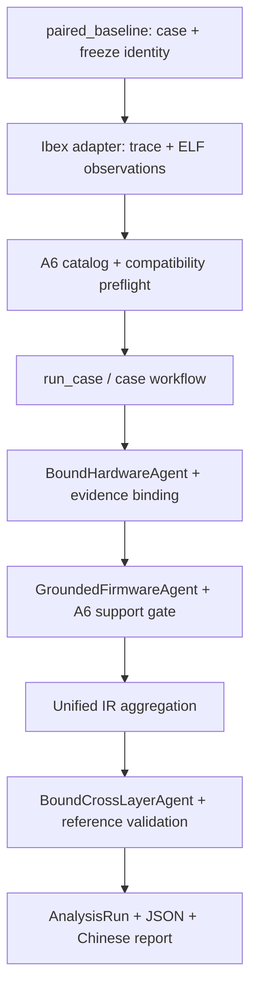

# V3-R1 / R1-A — Repository Audit & Mainline Definition

## Executive Summary

这是 audit-only 快照，基于 `main` / `39e72ee3a5cc1dd2eb1bb3db10ed218b93894c5e` / `v3-fw-a6-stable`。三个 Git 检查均匹配用户给定冻结候选；开始时工作区干净。没有生产源代码、既有文档、schema、support gate 或研究输出修改，没有新 LLM/API 调用、仿真或 RTL mutation。未开始 R1.1、XL1、FirmwareCapability 或 E0–E4。

关键结论：当前确实存在 A6 paired 三 Agent 主线，但它仍是依赖 Ibex 固定工作区的显式 integration CLI，而不是已经抽离的通用跨平台 paired workflow。R0 默认 stub、单侧研究 pipelines、XL0 matcher 与 A6 不是一条已完全合并的链。不能把所有“旧版本”删除，更不能把 import 可达当作业务能力被执行。

116 个 production Python module 分类：CORE_MAINLINE **58**；KEEP_RELOCATE **6**；RESEARCH_COMPATIBILITY **51**；ARCHIVE_CANDIDATE **0**；DELETE_CANDIDATE **0**；UNKNOWN_REQUIRES_REVIEW **1**。CORE 是架构保留分类，不等于每个文件本轮执行；KEEP_RELOCATE 也是保留建议，不授权立即移动。

逐模块责任、public declarations、正反 import 图、静态 call expressions、workflow closure、测试关联、首个 Git 引入与包含它的 tags、历史引用、分类依据、迁移目的及八项删除 gate 见 [机器清单](v3-r1-module-inventory.json)。完整审计方法及可重放脚本见 [方法](v3-r1-audit-methods.md)。

## Current Mainline

真实入口：`python -m chipchain.integrations.paired_baseline --firmware-grounding`；`main()` → `run_paired_baseline(...firmware_grounding=True)`。真实执行仍要求显式 real opt-in；本次不运行该联网命令。

| 顺序 | 实际模块 / 调用 | 边界 |
| --- | --- | --- |
| 1 | `integrations.paired_baseline.main` → `run_paired_baseline`；`integrations.deepseek.require_real_opt_in/load_deepseek_config` | 配置、角色模型选择；A6 并非无参数默认行为 |
| 2 | `domain.case.CaseBundle`；runner `digest`；`cross_layer.eligibility.parse_cross_layer_pair/cross_layer_pair_sha256` | 检查既有 ELF/simulator SHA、DATA1A freeze 与 eligible pair 身份 |
| 3 | `paired_baseline` → `subprocess.run` | 固定 Ibex 模拟器正常运行；本次 audit 替换此调用为读取历史 trace |
| 4 | `tools.paired.ibex.prepare_inputs` → `file_ref/parse_trace`、ELFFile、Capstone | 同一 adapter 同时建立 HW/FW observations，逐行绑定 trace/ELF 字节；不是两套通用 ingestion pipelines |
| 5 | `firmware.grounding_catalog.build_catalog` → `riscv_control_flow.resolve_transfer`、`resolve_ownership`；`control_flow_grounding` contracts/canonical/hash | 构建 A6 静态事实与独立 RVFI retirement observations |
| 6 | `grounding_compatibility.compatibility_preflight` | 在模型前阻断已提供冻结对象的 conflict；当前 paired 没有同源 A4/A5 输入，not_comparable 不等于 agree |
| 7 | `integrations.deepseek.build_deepseek_chat_model` → `paired_agents.BoundHardwareAgent`、`firmware.grounded_agent.GroundedFirmwareAgent`、`paired_agents.BoundCrossLayerAgent` | Hardware/Cross 仍使用 pilot ID-binding transport；Firmware 用 A6 typed claims |
| 8 | `execution.provenance.capture_provenance`；`workflows.case.build_case_workflow`；`execution.runner.run_case` | 组装现有 LangGraph，注入真实 observations 的副本 |
| 9 | `workflows.hardware.observe/analyze` → `RecordedAgent.invoke` → `BoundHardwareAgent.invoke` → `StructuredReportRuntime.invoke` → `paired_agents.hydrate/register` → `agents.hardware.validate_hardware_evidence` → `integrations.deepseek_hardware.validate_real_report` | 证据绑定与状态边界；不是 Hardware B2 `invoke_supported` |
| 10 | `workflows.firmware.observe/analyze` → `RecordedAgent.invoke` → `GroundedFirmwareAgent.context/invoke` → `grounding_support.build_projection/validate_claims/evaluate_claim/fact_text` | 保留 raw schema-valid 声明；精确 target/owner gate；从事实生成 canonical findings |
| 11 | `workflows.case.aggregate` → `ProcessorBehaviorIR`；`eligibility` → `workflows.state.cross_layer_input` | 汇合 HW/FW 已有 behaviors，检查两侧状态；并非把全部 A6 catalog 自动变成 IR |
| 12 | `workflows.cross_layer` → `RecordedAgent.invoke` → `BoundCrossLayerAgent.invoke` → `hydrate/register` → `paired_baseline.validate_cross_references` | 真实模型推理＋引用完整性；没有调用 XL0 atom matcher，也没有全面文字因果校验 |
| 13 | `execution.runner.analysis_run_from_state`；runner write；`firmware.grounding_report.render_report` | 分开保存 raw/validation/canonical/Chinese report、IR、provenance 与 manifest |

**时序与目标原则的区别：** 本实验的 Runtime/RTL Evidence 在模型调用前已经生成并作为输入。用户给出的 Facts → Contracts → Reasoning → Validation → Runtime Evidence 可以作为未来验证反馈链，不能错误描述为本次代码先做 LLM、最后才运行 RTL。

### 静态图与执行证据

- AST 的 paired import closure 是 **105/116** 个模块，包含函数局部 import、未执行分支及父包初始化，属于上界。
- 离线同路径 probe 有 **45** 个模块的 Python code 执行事件，其中 **33** 个模块执行具名函数，**12** 个仅观察到 module/class initialization；这些类体不能算 matcher/CFG 被调用。
- Probe 替换配置与 provider factory，用三个 `tests.fakes.fake_model`；模拟器调用替换为把已有 trace/stdout/console 复制到 `/tmp`。网络 connect 禁止，未读取 .env；临时目录已清理。没有真实 API 请求、没有新 repository output。
- probe 没有覆盖 provider 构造内部、配置读取及真实 simulator；这三处调用由 source AST 与历史 A6 元数据证明存在，本次执行性检查是 UNKNOWN/未运行。空 HW/Cross fake reports 不覆盖有 finding/candidate 的所有分支。
- `paired_execution_probe.functions` 原始 Python code 列表包含类体；逐模块 `paired_observed_functions` 才是过滤后的函数调用。`paired_observed_python_code` 保留原证据。
- 测试 profiling 覆盖 setup/call/teardown，记录 module execution，不等于语句覆盖率、分支覆盖率或断言充分性。没有观察到函数执行时明确 UNKNOWN，不能作为删除证明。

## Repository Inventory

基线计数以 `git ls-files` 为准，不把本次新 audit 文件计入冻结基线。

| 范围 | 数量 / 身份 |
| --- | --- |
| tracked files | 250 |
| src/chipchain Python | 116 |
| tests tracked / Python | 60 / 59 |
| pytest collected cases | 1190（含参数化与会 skip 的条目） |
| docs tracked / docs/research tracked | 47 / 30 |
| scripts tracked | 1：`scripts/ghidra/ExportFirmwareStructure.java` |
| samples tracked metadata | 3 个 README；真实本地 manifest/case metadata 被忽略 |
| output/reviewed tracked | 12 个 JSON/JSONL/manifest 文件 |
| 本地 samples/output 保护文件 | 4064（包括非 tracked 真实输入和研究历史） |
| Python / executable | 3.12.13；`/home/qcx/ChipChainV3/.venv/bin/python` |
| 主要环境 | pytest 9.1.1；Pydantic 2.13.4；Capstone 5.0.9；pyelftools 0.33；LangChain 1.2.10；LangGraph 1.0.10；langchain-deepseek 1.1.0 |

`repository_artifacts` 对 tests/scripts/docs/samples metadata/reviewed/examples 每个 tracked artifact 保存路径、类别和 SHA。`baseline.environment` 保存解释器及包版本；未读密钥。Git introduction 和 first containing tag 来自历史对象，不把阶段名称从模块名猜出来。全部 stable tags 及 commit/ancestor 关系另列于 JSON。

## Dependency Findings

### 四层架构是否已经成立

**从职责与调用顺序可观察到，但依赖边界尚未干净分层。** `domain` 提供 typed contracts，`tools`/`firmware` 产生事实，`agents` 推理，多个 support/runner gate 校验。Runtime evidence 是独立来源，不能替代推理支持。目录尚不能被称为四层已解耦。

明确的跨边界耦合（不是本轮发现事实被污染的证据）：

1. `tools/firmware/structure_projection.py` 导入 `agents.contracts.FirmwareAgentInput` 与 `agents.firmware_evidence`；确定性工具依赖 Agent 类型/registry。`tools/firmware/relation_builder.py` 等也围绕 AgentInput 组织，抽象方向需要单独设计。
2. `firmware/grounded_agent.py` 把模型 runtime 与 fact package 混放；`firmware/grounding_support.py` 在一个文件里同时放 model-facing claims、support evaluator、canonical report rendering 与 projection builder。
3. `paired_baseline.py` 为使用一个 `validate_real_report` 依赖整个 `deepseek_hardware.py`；后者牵入 EnCorpus 单侧集成。按 module import 粗暴裁剪会误判。
4. `agents/contracts.py` 依赖 `tools/contracts.py`；后者是 typed observation schema 而非执行工具，可接受但目录角色模糊；不应在 R1.1 随意改 schema 路径或类身份。
5. `cross_layer/__init__.py` 广泛 re-export matcher/facts/trigger，单独导入 eligibility 就加载其它 XL0 结构。**加载 matcher ≠ 执行 matching**。
6. `workflows/state.py` 直接构建 AgentInput；orchestration → agent contracts 是合理方向，不应仅为“core”目录对称而倒置。

没有在本次 scope 发现 A6 rejected target/owner 或 raw prose 进入 canonical report 的新证据；既有回归继续通过。但这不能升级为全工程任意语言声明的正确性保证。

### 零 importer 与 test-only：解释边界

没有任何**显式 Python importer**的模块共 9 个：

- `agents/model_outputs/__init__.py`
- `agents/projections/__init__.py`
- `domain/__init__.py`
- `firmware/__init__.py`
- `graphs/__init__.py`
- `tools/__init__.py`
- `tools/hardware/__init__.py`
- `tools/paired/__init__.py`
- `tools/firmware/ghidra/__main__.py`

前八个有隐式 package initialization 依赖；最后一个由 README:138 的 `python -m chipchain.tools.firmware.ghidra` 进入。**零 importer 不等于完全无调用者；没有认定任何文件可安全删除。**

显式 import 仅来自 tests 的非 package 文件：`tools/artifacts.py`、`integrations/angr_static_reachability.py`、`integrations/deepseek_hardware_supported.py`、`integrations/paired_baseline.py`。后三者都是已记录 CLI，不能叫 test-only behavior。`tools/artifacts.fingerprint_artifact` 当前仓内只有 `tests/unit/test_artifact_identity.py` 直接使用，外部 API 消费 UNKNOWN，列 UNKNOWN_REQUIRES_REVIEW。package `__init__` 的 test-only explicit importer 同样不能抹去隐式导入。

没有单独的 Python research/scripts-only importer 类；Java Ghidra exporter 是运行资源，不是 Python import。其消费者为 `tools/firmware/ghidra/process.py`，按显式工具路径调用审计。

## Legacy / Compatibility Paths

| 路径 | 当前 A6 paired 状态 | 保留理由 |
| --- | --- | --- |
| R0 `workflows.hardware/firmware` empty observer | 同文件真实 observer 分支执行；默认 stub 分支未执行 | 无参 run_case/run_cases 与 offline workflow public API 仍可到达；不是已死代码 |
| 三个 base Agent 无模型 stub | 子类构造会调用 base `__init__`；stub `invoke` 不作为本轮模型推理 | 兼容默认工作流与离线测试；删除会改变 API |
| `integrations/paired_agents.py` generic binding pilot | **BoundHardwareAgent / BoundCrossLayerAgent 实际执行** | 当前主线依赖；“pilot-only”不是弃用证据 |
| `agents/model_outputs/firmware.py` / 旧 firmware prompt | 由 base imports 装载；A6 override 不走其 hydrate invoke | 不带 grounding 的 paired 分支、B3 strip/hydrate、单侧研究与 reviewed 回放仍用 |
| `agents/projections/firmware.py` | **A6 context 仍执行该旧中性投影** | A6 增量 envelope 包含旧 firmware_context；不能删除 |
| `integrations/deepseek_hardware.py` | **只调用共享 validate_real_report** | EnCorpus runner 本身未运行，但抽取共享 gate 前不能归档文件 |
| Hardware A3/B2 typed support | paired 不调用 invoke_supported；部分 import 可达 | 单侧 CLI/tests/reviewed 实验语义仍有价值；A6 未替代硬件支持契约 |
| Firmware B2 enriched/B3 v1/v2 support | A6 paired 不走该 support policy | B3 v2 复用 v1 evaluator/types；reviewed exporter 仍分版本校验 |
| A4/A5 compare | 当前 preflight 未提供同源对象，不执行 compare_a4/compare_a5 | 单独 ARM 兼容性回归与冻结事实必须保留 |
| XL0 matcher | 包初始化会装载；本轮未执行 match_trigger_condition | 当前只消费 pair eligibility；matcher tests/synthetic teaching/frozen replay 保留 |
| Heat_Press / EnCorpus / Ibex-specific glue | 分别属于 corpus/platform adapters | 不应该提升为通用 core，也不应因平台专用而删除 |
| reviewed exporter | 不在 paired import closure | 被 deepseek_firmware 调用、由多组历史 schema 测试覆盖，是历史证据检查工具 |
| graphs/contracts.py | AgentInput/context API 引用 | 当前是 protocol/placeholder，不能把未实现 graph backend 与无依赖等同 |

未发现 `importlib.import_module`/`__import__` 动态导入语句。`getattr`、LangGraph callback、Pydantic 动态 transport schema、外部 CLI/用户 imports 仍不能由静态 AST 完全闭合，标记 UNKNOWN 而不是不存在。

## Duplication Findings

最大的 10 项历史债务如下。“重复”包含职责重复或多版本共存；不是已证明实现等价。

| # | 文件 / 现象 | 风险与后续动作 |
| --- | --- | --- |
| 1 | README 多个“当前阶段”与真实调用矛盾 | 先建立 CURRENT_STATE 单入口，历史 phase 文档只标范围 |
| 2 | paired_baseline 同时配置、运行模拟器、校验、调用、持久化 | 固定工作区、16K output budget、private runtime 读取混在一个 entry；后续拆 platform IO / orchestration / recording |
| 3 | pilot paired_agents + 通用 Agents + typed supported Agents 三轨 | 不同 gate 强度；当前主线仍用 generic HW/Cross，不能误称统一 typed support |
| 4 | FW model_outputs v1/v2、envelope v2/v3、relation_support v1/v2 与 A6 | v2 复用 v1，raw/accepted/orphan 语义不同；先建立 contract matrix 再合并 |
| 5 | canonical/hash 分散在 XL0 codec、HW/FW relations、A5、A3、A6、envelopes | A6 排除自身 hash，A4 有 evidence registry，列表归一化不同；禁止简单替换通用 json.dumps |
| 6 | evidence registry/hydration 分散在 firmware_evidence、model_outputs/firmware、paired_agents、HW/FW support | 输入范围、ID冲突、精确关系、copy semantics 不同；抽取底层工具前必须逐一等价测试 |
| 7 | projections/firmware + envelope v2/v3 + hardware relations + A6 build_projection | 多种预算、来源与 neutralization；不能为目录整齐合成无版本投影 |
| 8 | paired.prepare_inputs 与 A6 build_catalog 都读取 ELF/trace、核对字节、列函数并译码 | 一者构造平台 observations，一者构造确定性 target/owner；重复 IO 可后续优化，语义不能混并 |
| 9 | shared validate_real_report 寄居 EnCorpus integration；tools 的确定性分析依赖 AgentInput | import fan-out 和越层耦合增加删除风险；先抽契约依赖，不能直接搬到 core |
| 10 | reviewed_output 集中兼容多个 schema；旧 prompts/stubs 与实际方法分支混放 | 负结果和回放保护依赖旧语义；版本化 registry 可后续规划，不删老版本 |

AST 检测到 4 个文件中的 5 个潜在未使用 import 名字：`agents/hardware_support.py: HardwareRelationCatalog`、`cross_layer/contracts.py: CrossLayerPairDescriptor/CrossLayerPairManifest`（同文件两个名字）、`tools/firmware/angr_cfg.py: build_static_reachability`、`tools/hardware/encorpus/ibex_driver.py: Signal`，实际为 **4 文件、5 名字**。仅 Name-load/__all__ 检查，import 副作用和 public re-export 含义未证明，**不是 DELETE_CANDIDATE**。本次未清理。

## Documentation Drift

| 位置 | 分类 | 结论 / 未来操作 |
| --- | --- | --- |
| README:5 | stale current statement | “当前 DATA1A、待冻结”落后于 A6 HEAD/tag |
| README:19–24 | stale / scope ambiguity | XL0 当前阶段与后文 paired/A6 冲突；“不接入 Cross-Layer”仅对 XL0 当时成立 |
| README:28 | stale current statement | Hardware B2 待审核措辞与已有 stable tag 缺乏当前状态区分；tag 不是人工审核本身，具体审核结论 UNKNOWN |
| README:280 | contradictory statement | “真实 Cross-Layer Agent 集成仍未进入”与 :286–308 的 CLI、A6 source 和已有三 Agent记录矛盾 |
| README:293–296 | current only for ungrounded pilot / ambiguous scope | generic binding 描述适合未带 flag 的路径；不能概括 `--firmware-grounding` 固件侧 |
| README:298–315 | current statement | A6 opt-in 与 48/28K budget符合代码；当前 15 facts 是该样本结果，不是 domain invariant |
| docs/architecture/v3-r0.md:3,86,118 | historical statement | R0 的“当前无真实 analyzer/stub 默认”是阶段快照；后续不应将其当全工程当前架构 |
| docs/research/ibex-paired-llm-pilot.md:71 | historical statement | 原 pilot 语义验收未通过是真实负结果，不因 A6纠正而重写 |
| docs/research/v3-data1a-ibex-simple-system-baseline.md:14,378 | historical statement with explicit scope | Attempt 1 BLOCKED 已有历史标记，不能误报为现在仍 blocked |
| docs/research/v3-fw-a6-control-flow-grounding.md | historical first A6 regression | 初版 run/hash/1148 tests 属于旧实验；新版补充不是追写旧数据 |
| docs/research/v3-fw-a6-evidence-validation.md | current frozen A6 record | 1163/27、6 supported、原 prose 错误隔离与代码/产物相符；不声称全部模型文字正确 |
| docs/reports/acceptance/*、docs/tutorials/*、output/reviewed/* | protected historical/reporting artifacts | teaching、rejected、reviewed 有不同证据地位，不能统一成“最新真值” |
| 所有阶段 stable tags | historical identities, current A6 tag | 逐 tag commit/ancestor 已盘点；不新建、不移动 tag |

未来提议 `CURRENT_STATE.md`：唯一“当前”索引，记录 HEAD/tag、真实 CLI及 flags、每条路径的 gate 强度、明确不具备能力、最近验证命令/结果、历史索引和下一阶段。README 只链接这一索引并把历史章节标出阶段；**本轮不创建 CURRENT_STATE，也不修改 README 或任何旧文档**。

## Protected Research History

`production cleanup != research-history deletion`。下表“建议位置”是未来分类视图/索引，当前物理路径全部保留；若将来迁移，旧路径清单、hash、链接和回放定位都需保留。

| 历史类型 | 当前证据 / 示例 | 未来建议位置与禁止删除原因 |
| --- | --- | --- |
| raw real-model outputs / provider metadata | `output/<case>/<run>/` | KEEP 原位；可加 `research/history/runs/` 索引，记录可复核模型行为 |
| human-rejected Firmware / B3 negative runs | Heat_Press output 及 B3-R1/R2/R3 docs；`8b099ab7…` failure | KEEP 原位；`research/history/negative-runs/` 分类索引；失败正是 policy 改进证据 |
| DATA1A blocked attempt | `docs/research/data1/ibex-simple-system-blocked.json`、DATA1A Attempt1 | KEEP；`research/history/data1a/` 索引；不能把曾 blocked 擦成一直成功 |
| paired pilot semantic errors | `d362bd15…`、`ibex-paired-llm-pilot.md` | KEEP；按实验版本索引；提供 A6 真正动机与错误回归值 |
| A6 old/new regressions | `b0e049de…`、`100fcbb2…` 及两个 A6 docs | KEEP；分别索引，不合并 run/hash/usage 或修写模型输出 |
| reviewed snapshots | 12 个 tracked `output/reviewed/v3-1b1/*` 文件 | KEEP；未来 `research/reviewed/` 仅提案，export validation/replay依赖路径与manifest |
| tutorial teaching snapshots | `docs/tutorials/report-walkthrough/*` | KEEP；教学负例不是 accepted truth |
| acceptance reports | `docs/reports/acceptance/*` | KEEP；记录人工可读验收边界和已知错误 |
| frozen docs / tags | 30 份 research文件、architecture、28 个 tags | KEEP；所有 stable 身份和阶段结论都不能因代码剪枝删除 |
| oracle separation | tools/contracts roles、agents/contracts gate、EnCorpus readers/projection、对应 tests/docs | KEEP；防止 benchmark label/oracle 流入推理，需持续回归 |
| sample / shim / platform metadata | `samples/local-manifest.json`、case views、DATA1A freeze、shim | KEEP 原位；hash身份、来源和构建兼容性是重放条件；clone不包含全部真实文件 |

保护检查覆盖 **250 个基线 tracked 文件**和 **4,064 个 samples/output 本地文件**（集合有交集，不能简单相加称独立总数）。全部 A6 commit 的 **116 个生产 Python 文件 SHA** 与 Git blob 内容一致；详情见验证数据。

## Target Architecture Proposal

原则适合当前职责，但不建议立即套用所有目录。`domain/` 已是稳定公共 typed API，保留比一次性改成 core 更安全；`capability/`、`behavior_contract/`、`matching/validation` 的新语义目录本阶段不创建。

| Current path | Proposed path/action | 理由 | 风险 / dependent modules/tests |
| --- | --- | --- | --- |
| domain/common,evidence,case,provenance,run | KEEP domain/；未来 core 仅经 API 设计 | 标识/证据/target 已稳定，不强拆类模块 | 高；几乎所有 agents/tools/workflows；contract tests |
| firmware/control_flow_grounding,grounding_catalog,riscv_control_flow | KEEP；未来 firmware/grounding/ | 当前 A6 已可用，catalog/hash不能顺手改变 | 高；grounded_agent、support、compatibility、A6 tests |
| firmware/grounded_agent.py | 未来 agents/firmware_grounded.py＋旧 facade | 明确 LLM依赖边界 | 中高；paired_baseline、test_firmware_a6_workflow；不列最小批次 |
| firmware/grounding_report.py | reporting/firmware_grounding.py＋旧 facade | 纯展示、单一入口依赖，较适合先整理 | 中；paired_baseline、test_firmware_a6_evidence |
| firmware/grounding_support.py | KEEP；后续分别评估 claims/support/projection | 本文件多职责但gate极敏感 | 高；A6 exact support 与 raw隔离tests；不拆本批 |
| tools/paired/ibex.py | KEEP adapter；未来 adapters/ibex_simple_system.py | 同时产生HW/FW输入，强行分成两个ingestion会重复读取 | 高；A6 catalog借用parse_trace、paired tests |
| integrations/paired_agents.py | KEEP；未来 agents/paired_binding.py | 主线仍执行，不能archive | 高；paired runner、bindingtests、raw与canonical契约 |
| integrations/paired_baseline.py | KEEP CLI；未来 workflows/paired_analysis＋平台runner | 需先注入freeze/paths/recording，不仅移动文件 | 高；实际运行和本地工作区重放 |
| tools/firmware/*、tools/hardware/* | KEEP；未来 firmware/hardware ingestion adapters | Heat_Press/EnCorpus/Ghidra/angr必须保留平台语义 | 高；单侧研究CLI、冻结hash、oracle separation |
| cross_layer/* | KEEP；未来 pairing/matching分包 | 已有eligibility/matcher/facts职责，不重写XL0 | 高；re-export API、synthetic comparisontests |
| execution/reviewed_output.py | KEEP；未来 reporting/reviewed_output.py＋CLI facade | 历史重放验证与research输出管理 | 高；7组observedtest files、单侧FW CLI |
| workflows/*、execution/runner.py | KEEP | 现有注入式图和run生命周期可复用 | 中高；R0 defaults仍public，需显式offline方案才可裁剪 |
| tools/artifacts.py | REVIEW_REQUIRED，KEEP直到决定 | 只有test direct caller，外部usage/replacement等价性UNKNOWN | 未达到delete gate；test_artifact_identity |

目录草案中的 `reporting/canonical` 与 `human` 可先只建立一个 human renderer，不为占位新建空树；canonical事实仍由支持校验层生成。不要把 rendering与事实验证耦合迁到同一“报告工具”。

## Risks

- AST import closure 是保守上界，profile 单路径是下界；二者之间不是死代码清单。
- package import side effects 和版本化support复用让简单文件级删除风险很高。
- CLI/public external imports 没有完整消费者清单；R1.1必须保留facade。
- 当前 A6 是 opt-in；不带flag仍是generic固件路径。是否未来提升默认是行为变更，本轮只列问题。
- 部分 frozen provenance记录 implementation SHA；即使纯迁移也不能声称新实现manifest与旧完全相同。旧run原manifest保留；重放应使用旧tag，新的迁移等价性另记录。
- probe不证明network/provider/simulator流程本轮正常；没有新real call，历史结果只读引用。
- 27项测试skip的环境依赖能力没有重新执行，不应标PASS。
- Human/Cross通用prose仍不是全面semantic gate；A6只保护特定Firmware结构化事实。

## Open Questions

1. 外部用户是否依赖 `tools.artifacts.fingerprint_artifact` 或旧module路径？UNKNOWN。
2. R1后默认运行应是stub/offline还是强制explicit workflow？需要用户另行决定，不改变R0兼容承诺。
3. Hardware/Cross generic pilot是否由现有typed支持路径替代？两者语义范围不同，目前不能宣称等价。
4. 通用paired runner如何参数化freeze/platform/session？当前硬编码布局必须明确adapter责任后再拆。
5. 版本化canonicalization是否可共享底层实现而保持所有bytes/hash？尚未逐版本证明，UNKNOWN。
6. 实际缺失function size/indirect目标的后续取证不属于pruning；不为减少目录而改变unknown状态。

## R1.1 Proposed Actions

**Conditional GO：仅允许审阅通过后的最小批次，不批准广泛删除。** 先完成 CURRENT_STATE/README状态整理，再仅迁移独立中文renderer并保留旧facade。禁止删production module、删历史、合并support/canonicalization、变更默认workflow、升级XL1。本轮所有动作仅proposal。

文件级步骤、KEEP/RELOCATE/ARCHIVE/DELETE/REVIEW_REQUIRED与验收/回退约束见 [pruning plan](v3-r1-pruning-plan.md)。

## Validation Results

正常（不带profiling插件）的 `pytest -q`：**1163 passed, 27 skipped in 30.02s**。
额外profiling test run：1163 passed, 27 skipped in 66.13s (0:01:06)。pytest collection：1190 tests collected in 1.79s。
`python -m pip check`：**No broken requirements found.**
`python -m compileall -q src tests`：exit 0。
`git diff --check`：exit 0。

生产源SHA与A6 Git blob比较 **116/116相同**；全部250个初始tracked文件不变；4064个samples/output本地保护文件不变。只有本轮新R1 audit文件未跟踪，未执行Git add/commit/push/tag。精确记录见 [validation JSON](v3-r1-validation.json)。

本阶段真实LLM/API调用 **0**，真实simulator运行 **0**；offline probe有3次fake transport invoke，不计为模型服务调用。没有改动output/reviewed/history，没有R1.1动作。
