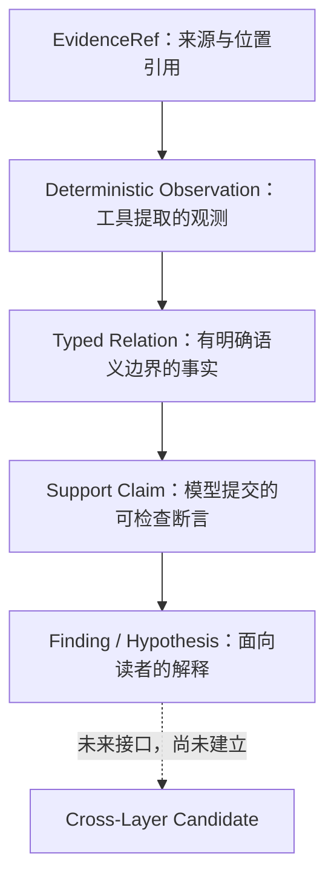

# 如何阅读 ChipChain Hardware / Firmware 分析报告

这是一份中文 JSON 阅读教程。读完后，你应能回答：这段话属于哪个 case/run？它引用了什么事实？
事实足以支持这段话的哪些部分？哪些部分仍只是候选解释？

**教学收录不等于科研审核通过。** 本目录不属于 `output/reviewed/`，也不会改变源报告的审核状态。
基线为 `v3-hw-b2-stable` / `5f42afd9efb63393e04975b63ea9cd613094bdbc`。

## 从这里开始

| 教程 | 真实材料 | 阅读重点 |
| --- | --- | --- |
| [Hardware 743 逐字段解读](hardware-743/report-walkthrough.md) | B2 run `e4636d59-ef13-42d3-ab19-acedb3b60143` 的 report 与 support audit | 从 F3 的 lw 编码一路追到 SC3、A3 relation、EvidenceRef；理解 H1 为什么仍是假设 |
| [Firmware Heat_Press 逐字段解读](firmware-heat-press/report-walkthrough.md) | 历史 B2 report + 另一次 R3 support failure | 识别错误的 Reset→SystemInit 单跳调用说法，理解类型化检查为何拒绝错误 |

Firmware 两个文件来自不同 run：历史 canonical 为 `104a5332-3cf3-4263-b988-8b5b0b82f14e`，
R3 diagnostic 为 `db343655-ddd8-4b69-8dec-4d0149e38abf`。
**不能把 R3 support IDs 接到历史 B2 report 上，假装它们属于一次运行。**

四个 JSON 是源 runtime 文件的逐字节副本，未修复语义错误、未格式化。
每例 [Hardware manifest](hardware-743/manifest.json) / [Firmware manifest](firmware-heat-press/manifest.json)
逐文件记录 source run、source path、SHA、machine/review status。Markdown 中的节选明确标注省略范围；
它们帮助阅读，不替代完整 JSON。没有复制 invocation、环境文件、原始样本或 provider response。

## 先分清三种状态轴

不要把不同层面的 `status` 当作一个可信度分数。

| 状态轴 | 例子 | 回答的问题 |
| --- | --- | --- |
| 运行/审核状态 | machine_valid、historical_machine_valid、rejected_by_support_gate、not reviewed | 哪个 pipeline 接受过它？是否经人工认可？这些状态主要见 manifest/运行记录。 |
| 认识论状态 `epistemic_status` | observed、derived、inferred、hypothesized | 这项内容自称来自直接记录、确定性加工，还是推断/假设？标签本身不证明正文正确。 |
| 关系/支持状态 | confirmed_static、unresolved；supported、unsupported、incompatible | relation 提供什么事实？submitted typed assertion 是否与之匹配？ |

`derived` 的模型 summary 也可能解释错。Firmware 历史报告正是反例。

## 核心表：supported / incompatible / unsupported

| Result | 含义 | Hardware 例子 | Firmware 例子 |
| --- | --- | --- | --- |
| supported | 提交的 typed assertion 与 deterministic fact 匹配 | **真实** SC3：lw encoding/decode @50 ns 与 A3 匹配 | **合成教学断言**：准确提交 `call-80afa` 的 `f80af4→f80eac`、direct_call/confirmed_static；不是声称本目录 R3 有这条成功记录 |
| incompatible | assertion 与已有 deterministic fact 的字段不一致 | **合成反例**：把 x10@70 的 host=0x1000/ref=0 写反 | **真实 R3** `sc-call-80bd2` 错把目标 f81052 写成 f8106c |
| unsupported | 现有事实缺少证明这种语义的能力 | **合成反例**：用 SC3 指向的 encoding fact 证明 instruction_executed | **合成反例**：用 A5 reachable_static 路径证明 runtime reachability |

合成例子只是教学问答，没有被插入任何 JSON snapshot。R3 本次实际失败是 37 个 incompatible，
不是 37 个 unsupported。supported 也不代表自然语言整句已经形式化证明。

## Evidence hierarchy：每层承担什么

这是解释依赖方向，不是说每个 JSON 都逐层嵌套，也不是自动证明链。
EvidenceRef 指向 artifact/位置；它不是文件内容本身。Observation 由工具提取；relation 将其语义和能力明确化。
Support claim 是待比较的断言，**不是另一份事实源**。Finding/hypothesis 自由文本还需要读者检查是否越界。
未来跨层候选仍必须另有合同与证据，不能把两个单侧故事拼在一起当成因果链。

Behavior 是另一条用于表达处理器相关行为的结构化线索：由 observation 提供，在 ProcessorBehaviorIR 中汇总。
本教程报告只带 behavior IDs，不包含完整 IR；不能从一个 ID 的名字臆造执行记录。

## Epistemic status：知道多少，不是确信多少

项目实际 enum 见 [common.py](../../../src/chipchain/domain/common.py)。

| 值 | 本项目中的阅读方式 | 本教程实际情况 |
| --- | --- | --- |
| observed | 记录层面的观测，例如历史 formal log 的结果；不等于重新验证其结论 | Hardware F9/F10；Firmware opaque input/config finding |
| derived | 从证据确定性加工得到，或模型对结论使用了该标签；必须追源核对 | A3 waveform 提取/解码；Hardware F3/F8。Firmware 错误 Reset finding 也标 derived，不能盲信。 |
| inferred | 基于已有事实作解释推断，仍不是验证结果 | 历史 Firmware UART candidate |
| hypothesized | 候选解释，有待补充证据/验证；不要求已有事实证明因果 | Hardware H1；Firmware UART reachable behavior 候选 |
| verified | enum 中存在，但当前 supported Hardware gate 不接受模型自己生成 verified；Firmware 真实策略也拒绝模型自行验证 | 本教程两份 canonical report 均无 verified；不存在 verified vulnerability 示例 |
| unknown | 当前信息不足、尚未确定 | Firmware external input / reachability 字段 |
| refuted | enum 支持被否定的状态；不能仅凭一次 lack-of-support 自动填成 refuted | 本教程 canonical 条目未使用 |

Hardware B2 trigger 只接受 hypothesized/inferred。JSON 中出现一个枚举值，不能替代这个阶段的 gate 规则。

## 固定的十步 JSON 阅读流程

1. 看 `case_id` 和 manifest 的 `source_run_id`，确认正在读哪个文件、哪次运行。
2. 看该 item 的 `epistemic_status`，同时看 machine/review status，分清观测、推断和假设。
3. 不先相信 `summary`；把其中每个断言拆开阅读。
4. 追 `support_claim_ids`。Canonical Hardware 没有这个字段，要从 audit 的 `referencing_hardware_claims` 反查；历史 Firmware B2 本来就没有 typed support，不能补造。
5. 看 support `result`、`reason` 和 referenced/orphan usage；只看 “supported” 字样不够。
6. 追 `relation_id`，比对 kind/status、source/target、时间、signal、值等 typed fields。
7. 看 relation `capabilities`。没有能力支持的 execution/causality 等结论不能升级。
8. 必要时继续追 EvidenceRef 的 artifact、analyzer、location；`null` 表示未提供，不是 0。
9. 阅读 `unresolved_questions` 或 relation limitations。R3 diagnostic 故意没有 rejected prose/问题列表。
10. 最后形成自己的结论，写清支持了什么、没有支持什么以及仍需什么证据。

只有四份 snapshot 也可以完成主要阅读；A3 真实 relation 与 A5 witness 的准确节选已放入教程。
不需要运行模型、读取原始 provider response 或安装 angr 来学习。

## 中文术语表

| 术语 | 解释 |
| --- | --- |
| case | 一个分析案例的身份与输入引用。case_id 不是漏洞编号；同一个 case 可以有多次 run。 |
| run | 一次分析运行。比较报告前先确认 run ID，避免把不同版本的证据与结论混用。 |
| artifact | 输入或结果材料，例如 VCD、ELF、log。ArtifactRef 通常保存引用/元信息，EvidenceRef 再定位其中的证据。 |
| EvidenceRef | 证据来源和位置的结构化引用。ID 存在只说明引用能对上，不能证明随附 summary 的全部解释。 |
| observation | 确定性工具从材料中提取的观测。采样点和 formal 事件各有不同的解释边界。 |
| behavior | ProcessorBehavior 中的一项处理器相关行为描述。名称如 register-state 不证明 register read/write。 |
| IR | Intermediate Representation，中间表示。这里的 ProcessorBehaviorIR 汇总结构化 behaviors，不是模型自由生成的执行轨迹。 |
| relation | 有类型的事实关系/观测语义，含明确属性和能力。Hardware sample relation 与 Firmware static relation 的种类不同。 |
| support claim | 模型提交、由 checker 与 relation 对照的 typed assertion。它可以通过、冲突或能力不足；本身不是事实源。 |
| finding | Agent 整理出的发现条目。可以是事实概述、缺口或推断，不天然意味着漏洞。 |
| issue anchor | Firmware 中供后续研究定位的问题线索，关联 findings/behaviors/evidence。不是已经验证的攻击入口。 |
| abnormal state | Hardware 异常状态描述。本例主要描述 host/reference 差异，不自动判断哪侧错误或根因是什么。 |
| trigger hypothesis | 候选触发解释。supported factual basis 不验证假设的方向、机制或因果正确性。 |
| epistemic status | 说明断言依据类型/认识程度的状态标签。不要将模型选择的标签当作真实性证书。 |
| static reachability | 静态分析图中存在符合当前查询规则的路径。可能受 heuristic recovery 和抽象规则影响。 |
| runtime reachability | 实际运行条件下能够到达的性质或观测；不能由 static path 自动得到。具体是否发生还需相应运行证据。 |
| reviewed | 项目中带明确科研审核意义的状态/导出区。教学副本、machine-valid 和助手文字审阅都不自动赋予 reviewed 身份。 |

## 完整性与范围

每个 manifest 的 `files[]` 都是一个独立 provenance record；Firmware 必须逐条看其 source_run_id/status。
`source_sha256 == snapshot_sha256` 且 `byte_identical=true`，表示复制完整性，不表示语义审核通过。
JSON 已运行既有 `_safety`（含本地已配置密钥匹配、危险字段/凭据模式）及绝对私人路径检查；未发现需阻止收录的内容。
未新增导出脚本到仓库，没有分析实现、schema、prompt、测试或 reviewed 文件改动。

本轮验证记录（DOC-1，2026-09-15）：

| 检查 | 结果 |
| --- | --- |
| pytest -q（项目 .venv） | `976 passed, 27 skipped in 27.31s`，与基线数量一致 |
| python -m pip check（项目 .venv） | `No broken requirements found.` |
| git diff --check | 通过 |
| 四份 runtime JSON 复制完整性 | source/snapshot SHA 相同、逐字节相同、无重新格式化 |
| 六份教学 JSON（含 manifests） | 既有安全检查通过；未发现私人绝对路径 |
| Markdown | 本地文件链接、JSON 节选可解析、无占位符或尾随空白 |
| 既有 source/tests/output | 101 个 source、50 个 tests、81 个 output 文件 SHA 不变 |
| output/reviewed | 12 个文件 SHA 不变，未新增 reviewed 文件 |

未调用 DeepSeek/真实 Agent；仅按要求 fresh-build 743 的既有 A3 catalog，未改变分析逻辑，未保存新 runtime output。
除 root README 教学入口外，只新增本目录；未新增仓库脚本，未 git add/commit/push/tag。
