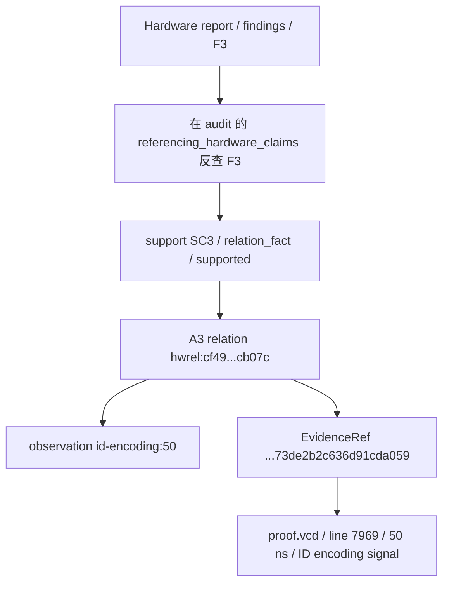

# Hardware 743：从报告中的 lw，一直读到采样证据

本例读取 case `encorpus:ibex:driver:743` 的 Hardware B2 run
`e4636d59-ef13-42d3-ab19-acedb3b60143`。
[report](hardware_analysis_report.json) 与 [support audit](hardware_relation_support.json)
都是已有 runtime 文件的原样副本；[manifest](manifest.json) 记录完整来源与哈希。
它是 machine-valid 教学样例，**不是 reviewed export，也不是 verified vulnerability**。

建议同时打开两个 JSON，用下面给出的 ID 搜索。JSON 对象字段顺序没有语义；这里按理解顺序讲解。
Markdown 中“字段节选”只省略无关字段，完整 snapshot 不作任何删改。

## 第一层：先认报告身份

| 字段 | 本例值/结构 | 人话 |
| --- | --- | --- |
| `case_id` | `encorpus:ibex:driver:743` | “我在讨论 driver/743 这个案例”，不是 CVE 或漏洞编号。 |
| `processor_behavior_ids` | 5 个 ID | 3 个 instruction 编码行为、x28@50 与 x10@70 两个 register-state 行为的索引。不是 5 次已经证明的执行。 |
| `findings` | 10 个对象 | 模型把 observation 整理成可读发现。 |
| `abnormal_states` | 2 个对象：S1、S2 | 对多个局部/寄存器差异的归纳。 |
| `trigger_hypotheses` | 1 个对象：H1 | 对这些事实可能关联的候选解释。 |
| `unresolved_questions` | 6 条字符串 | 尚不能证明执行、方向、因果、配置关联、物理可观测性等。 |

Report 本身没有 `run_id`。应从 manifest/source directory 找到 run，而不是从 case_id 猜。
例如 behavior `encorpus:ibex:driver:743:id-encoding:50:instruction` 是行为引用，
与 finding `F3`、support `SC3`、relation `hwrel:...` 分属不同 ID 空间。

## 第二层：先读两个代表性 findings

### F3：lw 编码与解码

下面是 `findings` 中 `finding_id=F3` 的字段节选；这里只列 `evidence[0]`，完整数组有 4 个 EvidenceRef。


```json
{
  "finding_id": "F3",
  "summary": "At 50 ns the host ID-stage signal miter.\\host.u_ibex_core.if_stage_i.instr_rdata_alu_id_o carried encoding 0x007e2503 (00000000011111100010010100000011), deterministically decoded as lw x10, 7(x28). This is a sampled encoding observation at the ID stage; execution, commitment and retirement are not established.",
  "evidence": [
    {
      "evidence_id": "encorpus:ibex:driver:743:proof.vcd:e:73de2b2c636d91cda059",
      "source_type": "deterministic_analyzer",
      "artifact_id": "encorpus:ibex:driver:743:proof.vcd",
      "analyzer": "encorpus-ibex-driver-v1",
      "location": {
        "address": null,
        "function": null,
        "basic_block": null,
        "line": 7969,
        "instruction_index": null,
        "register_name": null,
        "signal": "miter.\\host.u_ibex_core.if_stage_i.instr_rdata_alu_id_o",
        "time": {
          "value": 50,
          "unit": "ns"
        },
        "bit_range": {
          "msb": 31,
          "lsb": 0
        }
      },
      "summary": "Value at this time carried from source assignment.",
      "epistemic_status": "derived"
    }
  ],
  "processor_behavior_ids": [
    "encorpus:ibex:driver:743:id-encoding:50:instruction"
  ],
  "epistemic_status": "derived"
}
```


逐字段理解：

| 字段 | 怎么读 |
| --- | --- |
| `finding_id=F3` | 仅在本报告内标识这条发现。 |
| `summary` | 模型的自然语言解释；先核对其中 encoding/time/decode，再检查“不证明执行”等边界。 |
| `evidence` | 四个 exact EvidenceRef，涵盖 encoding signal 及相关 validity/executing/PC 采样来源。不是模型任意生成的引文。 |
| `processor_behavior_ids` | 指向同一 50 ns instruction-encoding behavior，IR 由确定性输入保留。 |
| `epistemic_status=derived` | 这是采样提取与解码所得的内容；并不把“指令执行了”变成事实。 |

人话：**在 50 ns 的 host ID-stage signal 上看到了一个 32-bit 编码，确定性解码器把它读成
`lw x10, 7(x28)`。** 不能据此说处理器完成了这次 load、写回 x10 或退休了该指令。

### F8：x10 的 register-state 差异

以下字段节选只展示第一条 evidence；原对象保留 host/reference 两个 EvidenceRef。


```json
{
  "finding_id": "F8",
  "summary": "At 70 ns the host register-file storage bits [351:320] associated with x10 sampled 0x1000 while the reference counterpart sampled 0x0. This is a sampled register-state difference; read/write direction, access and retirement are not established.",
  "evidence": [
    {
      "evidence_id": "encorpus:ibex:driver:743:proof.vcd:e:c7a34ab5ba2be0840468",
      "source_type": "deterministic_analyzer",
      "artifact_id": "encorpus:ibex:driver:743:proof.vcd",
      "analyzer": "encorpus-ibex-driver-v1",
      "location": {
        "address": null,
        "function": null,
        "basic_block": null,
        "line": 8263,
        "instruction_index": null,
        "register_name": "x10",
        "signal": "miter.\\host.gen_regfile_ff.register_file_i.rf_reg_q",
        "time": {
          "value": 70,
          "unit": "ns"
        },
        "bit_range": {
          "msb": 351,
          "lsb": 320
        }
      },
      "summary": "Value at this time carried from source assignment.",
      "epistemic_status": "derived"
    }
  ],
  "processor_behavior_ids": [
    "encorpus:ibex:driver:743:difference:96a610aee373:70:register-state"
  ],
  "epistemic_status": "derived"
}
```


| 字段 | 怎么读 |
| --- | --- |
| `finding_id=F8` | 指向这个 register difference 发现，不是一个写寄存器事件 ID。 |
| `summary` | 70 ns 的 x10 对应 slice，host=0x1000、reference=0；read/write/access/retirement 均未建立。 |
| `evidence` | 两侧同一采样时刻的 storage slice 引用，应一起看，避免颠倒 host/reference。 |
| `processor_behavior_ids` | `encorpus:ibex:driver:743:difference:96a610aee373:70:register-state`。只说明 register-state behavior。 |
| `epistemic_status=derived` | 值差异来自确定性提取；没有推导访问方向。 |

人话：**两侧保存的值在这个采样点不同。** 不知道此前是哪侧写入、谁正确，或是否由 F3 的 lw 导致。
`bits [351:320]` 是 packed register-file 的 slice，不是“x10 有 352 位”。本次值宽度仍是 32 bits。

## 第三层：abnormal_states 是归纳，不是根因

搜索 `state_id=S1`：

> Sampled host/reference divergence in the load/store unit FSM: host ls_fsm_ns = 010 vs reference 000 at 50 ns and 70 ns, and host ls_fsm_cs = 010 vs reference 000 at 60 ns. Recorded as sampled local-state differences only; no continuous interval, causality or trigger is established.


S1 的 `hardware_finding_ids` 为 F4/F6/F7，对应三条独立记录：

| Time | Host/reference signal 后缀 | Host / reference raw value |
| --- | --- | --- |
| 50 ns | ls_fsm_ns | 010 / 000 |
| 60 ns | ls_fsm_cs | 010 / 000 |
| 70 ns | ls_fsm_ns | 010 / 000 |

它带 6 个 evidence、`processor_behavior_ids=[]`、`epistemic_status=derived`。
空 behavior 列表不表示没有证据：这些 local observations 没有生成额外 ProcessorBehavior。
不能仅因同属一个 FSM 就把 **ns、cs 两个信号的三点差异** 合并成某一 signal “连续保持 50–70 ns”。

`abnormal state != root cause != verified vulnerability`。
这里 abnormal 描述可见的两侧差异，既不决定 host/reference 谁是 ground truth，也不证明安全影响。

## 第四层：详细读 H1

搜索 `hypothesis_id=H1`。下面保留其完整 summary、constraints、finding/behavior IDs 和 epistemic status；
只在这个 Markdown 节选中省略 evidence 数组，原 JSON 有 11 个 EvidenceRef。


```json
{
  "hypothesis_id": "H1",
  "summary": "Tentative: the host/reference divergence in the load/store unit FSM state (host 010 vs reference 000 at 50/60/70 ns) may be associated with the sampled lw x10, 7(x28) encoding at 50 ns and the sampled x28/x10 register-state differences. This remains a hypothesis: the supplied evidence is sampled points only, no continuous interval, no execution/retirement, no read/write direction and no causal linkage is established.",
  "hardware_finding_ids": [
    "F3",
    "F4",
    "F5",
    "F6",
    "F7",
    "F8"
  ],
  "processor_behavior_ids": [
    "encorpus:ibex:driver:743:id-encoding:50:instruction",
    "encorpus:ibex:driver:743:difference:81047f8de03d:50:register-state",
    "encorpus:ibex:driver:743:difference:96a610aee373:70:register-state"
  ],
  "constraints": [
    {
      "subject": "load_store_unit_i.ls_fsm state",
      "relation": "host_minus_reference_sampled_value",
      "value": "010 vs 000 at 50/60/70 ns"
    },
    {
      "subject": "x28 register-file bits [927:896]",
      "relation": "host_minus_reference_sampled_value",
      "value": "0x0 vs 0x1 at 50 ns"
    },
    {
      "subject": "x10 register-file bits [351:320]",
      "relation": "host_minus_reference_sampled_value",
      "value": "0x1000 vs 0x0 at 70 ns"
    },
    {
      "subject": "verification",
      "relation": "missing",
      "value": "continuous interval coverage, execution/retirement evidence, read/write direction, causal linkage, independent formal replay"
    }
  ],
  "epistemic_status": "hypothesized"
}
```


- `summary` 用 **Tentative / may be associated**，不是“已经导致”。
- `hardware_finding_ids` F3/F4/F5/F6/F7/F8，把 lw 编码、LSU 样本、x28/x10 差异汇集为事实基础。
- `processor_behavior_ids` 指向 lw@50、x28@50、x10@70。没有新造 causal behavior。
- `constraints` 是描述性条件对象：`subject` 说对象，`relation` 说比较方式，`value` 写记录/缺口。
  **它们不是 SMT 公式，也不是 solver 已满足条件的证明。**
- `epistemic_status=hypothesized` 表示一个尚待检验的候选解释。不是 50% 概率，也不是弱形式 verified。

H1 概述用 FSM state 泛称关联 ns/cs，读者应回到 S1 的独立 signal/time 表，不能合并成连续状态。
即使七个被引用 supports 都 supported，也只说明事实断言匹配，不证明 H1 的因果机制。
需要独立执行/提交轨迹、访问方向、受控 replay 等新证据才能检验更强解释；本教程没有做这些验证。

## 第五层：canonical item 如何找到 support

**在 canonical `hardware_analysis_report.json` 里找不到 `support_claim_ids` 是正常的。**
B2 的模型专用 schema 有该字段，但 hydration 后长期 domain schema 保持不变。
读取 [audit](hardware_relation_support.json)，按 `referencing_hardware_claims` 反查即可：

| Item | audit 中反查得到的 support IDs |
| --- | --- |
| F3 | SC3、SC6 |
| F8 | SC11 |
| S1 | SC7、SC9、SC10 |
| H1 | SC3、SC6、SC7、SC8、SC9、SC10、SC11 |

顶层 `schema_version=hardware-relation-support/v1`。本例 generated=13、referenced=13、
referenced_supported=13、orphan=0。`support_claims[]` 每条包含：

| 字段 | 意义 |
| --- | --- |
| `support_claim` | 模型提交的 typed assertion，包括 support ID、claim_type、expected 字段。 |
| `usage_status` | referenced 表示确有 item 引用；orphaned 表示无人引用，不能暗中支持任何 item。 |
| `result` / `reason` | checker 的三态结果及固定原因；本例都是 supported / exact_fact_match。 |
| `relation_ids` | 此 support 对照的 deterministic relation IDs。 |
| `referencing_hardware_claims` | 反向索引，只记录 collection/claim_id，不重复 summary。 |

### 完整追踪：F3 → SC3 → lw relation → EvidenceRef



图中 relation ID 是为排版缩写；以下完整真实 ID 可直接搜索：

`hwrel:cf49fcb2378a2cba7c3443887da56ba7cf592a8e42bb690f8f471753354cb07c`

SC3 完整 audit entry 如下，直接来自教学 snapshot：


```json
{
  "support_claim": {
    "support_claim_id": "SC3",
    "claim_type": "relation_fact",
    "relation_id": "hwrel:cf49fcb2378a2cba7c3443887da56ba7cf592a8e42bb690f8f471753354cb07c",
    "expected_kind": "instruction_encoding_observed",
    "expected_status": "derived",
    "expected_attributes": {
      "kind": "instruction_encoding_observed",
      "time": {
        "value": 50,
        "unit": "ns"
      },
      "stage": "id",
      "signal_id": "miter.\\host.u_ibex_core.if_stage_i.instr_rdata_alu_id_o",
      "encoding_bits": "00000000011111100010010100000011",
      "encoding_width_bits": 32,
      "encoding_representation": "decompressed_word",
      "decoded_instruction": {
        "status": "decoded",
        "mnemonic": "lw",
        "operand_text": "x10, 7(x28)",
        "instruction_width_bits": 32,
        "decoder": {
          "tool_name": "capstone",
          "tool_version": "5.0.9",
          "tool_role": "instruction_decoder",
          "configuration_sha256": "30d598458f418ad3d0c43b23de0e4564b5d57a19b9b7d8f0abe317f68161040c"
        }
      }
    }
  },
  "usage_status": "referenced",
  "result": "supported",
  "reason": "exact_fact_match",
  "relation_ids": [
    "hwrel:cf49fcb2378a2cba7c3443887da56ba7cf592a8e42bb690f8f471753354cb07c"
  ],
  "referencing_hardware_claims": [
    {
      "collection": "findings",
      "claim_id": "F3"
    },
    {
      "collection": "trigger_hypotheses",
      "claim_id": "H1"
    }
  ]
}
```


`expected_attributes` 是模型应提交的精确断言，不是它自行定义事实。SC6 是对同一 relation 的
`instruction_encoding_observed` semantic claim；重复引用不增加证据强度。

### 它最终指向什么 A3 事实？

本轮按已有 pipeline **fresh-build** 743 A3 catalog，未调用 Agent、未新增分析算法或 runtime 文件。
得到 10 relations、29316 chars，SHA256
`e9f0da2fea7df21b9a028c38b685292895d160ad3b521b77e4bd568cace23753`，与冻结 A3 一致。
以下是其中 lw relation 的精确字段节选；仅保留解读必需的 decode 子字段和 capabilities，
完整 A3 合同另见 [研究文档](../../../research/v3-1a3-hardware-typed-relations.md)。


```json
{
  "relation_id": "hwrel:cf49fcb2378a2cba7c3443887da56ba7cf592a8e42bb690f8f471753354cb07c",
  "kind": "instruction_encoding_observed",
  "status": "derived",
  "source_observation_id": "encorpus:ibex:driver:743:id-encoding:50",
  "attributes": {
    "encoding_bits": "00000000011111100010010100000011",
    "encoding_representation": "decompressed_word",
    "encoding_width_bits": 32,
    "kind": "instruction_encoding_observed",
    "signal_id": "miter.\\host.u_ibex_core.if_stage_i.instr_rdata_alu_id_o",
    "stage": "id",
    "time": {
      "unit": "ns",
      "value": 50
    },
    "decoded_instruction": {
      "raw_encoding": "0x007e2503",
      "status": "decoded",
      "mnemonic": "lw",
      "operand_text": "x10, 7(x28)",
      "instruction_width_bits": 32,
      "decoder": {
        "configuration_sha256": "30d598458f418ad3d0c43b23de0e4564b5d57a19b9b7d8f0abe317f68161040c",
        "tool_name": "capstone",
        "tool_role": "instruction_decoder",
        "tool_version": "5.0.9"
      },
      "epistemic_status": "derived"
    }
  },
  "capabilities": {
    "supports_causal_propagation": false,
    "supports_continuous_interval": false,
    "supports_formal_causality": false,
    "supports_formal_result_observed": false,
    "supports_instruction_commit": false,
    "supports_instruction_decode": true,
    "supports_instruction_encoding_observed": true,
    "supports_instruction_execution": false,
    "supports_instruction_retirement": false,
    "supports_mutation_identity": false,
    "supports_physical_observability": false,
    "supports_register_read": false,
    "supports_register_write": false,
    "supports_root_cause": false,
    "supports_same_configuration": false,
    "supports_sampled_fact": true,
    "supports_sampled_local_difference": false,
    "supports_sampled_register_difference": false,
    "supports_trigger_causality": false,
    "supports_verified_trigger": false,
    "supports_vulnerability": false
  }
}
```


| 可问的问题 | 该 relation 是否提供支持？ |
| --- | --- |
| ID-stage encoding observed @50 ns | 是 |
| Deterministically decoded as lw x10, 7(x28) | 是，Capstone 5.0.9 derived |
| Instruction executed | 否，没有该能力；不是证明“未执行” |
| Committed / retired | 否，没有该能力 |
| Causal trigger | 否，没有该能力 |

### 再追一层 EvidenceRef

从 `relation.evidence_ids` 找到
`encorpus:ibex:driver:743:proof.vcd:e:73de2b2c636d91cda059`，
与 F3 的 `evidence[0]` 内容完全一致：


```json
{
  "evidence_id": "encorpus:ibex:driver:743:proof.vcd:e:73de2b2c636d91cda059",
  "source_type": "deterministic_analyzer",
  "artifact_id": "encorpus:ibex:driver:743:proof.vcd",
  "analyzer": "encorpus-ibex-driver-v1",
  "location": {
    "address": null,
    "function": null,
    "basic_block": null,
    "line": 7969,
    "instruction_index": null,
    "register_name": null,
    "signal": "miter.\\host.u_ibex_core.if_stage_i.instr_rdata_alu_id_o",
    "time": {
      "value": 50,
      "unit": "ns"
    },
    "bit_range": {
      "msb": 31,
      "lsb": 0
    }
  },
  "summary": "Value at this time carried from source assignment.",
  "epistemic_status": "derived"
}
```


`artifact_id` 指向 proof.vcd，`analyzer` 指明既有提取器，`location` 指明 line、signal、time、bit_range。
`summary` 的 carried from source assignment 提醒你：行号是来源赋值位置，可能早于采样时刻，并不保证当时出现新变化。
`address=null` 不等于 address=0，`line` 也不是 CPU PC。

同一 relation 还引用名为 `instr_executing` 的 signal。**signal 名字本身不改变 A3 的 capability**；
冻结 contract 仍不支持 instruction execution claim，不能绕过 checker 只看一个信号名字下结论。

## supported 的准确含义

> `support.result = supported`：模型提交的 typed assertion 与 deterministic relation 匹配。

它不意味着 finding 整句自然语言已经形式化证明。实际 gate 检查 ID、typed attributes、证据/行为绑定和
认识论规则；不会用 NLP 把 summary 的每个语义命题都形式化。

所以 H1 引用七个正确的 facts，仍只是 hypothesized。`supports_instruction_execution=false` 不是说指令一定没执行，
而是说**当前证据不能支持这个断言**。更多例子见[三态教学表](../README.md#核心表supported--incompatible--unsupported)。

## 对照框：为什么 820 machine-valid 仍需人工审核

不新增第三份 snapshot。仅引用既有 [B2 语义审阅](../../../research/v3-1b2-structured-hardware-support.md#820-semantic-audit助手逐项审阅供人工决定)
中的短片段：**“host-side write or update to x10”**。

| 断言 | 当前证据支持吗？ |
| --- | --- |
| sampled register difference | supported |
| host performed write/update | not established |

820 hypothesis 确实标为 tentative/hypothesized，也承认方向未知。但提出哪侧发生写入仍是缺少方向证据的猜测。
其 support 只是合法的 sampled fact，所以可以 machine-pass；这不把方向性解释变成 deterministic truth。
保持原报告、单独标出语义问题，比偷偷改写 snapshot 更能帮助复现实验。

## 我可以相信什么？

| 字段/结论 | 可以直接相信？ | 为什么？ | 还需要什么？ |
| --- | --- | --- | --- |
| case/run/source SHA | 可用于身份/复制完整性核对 | manifest 与原文件匹配 | 不等于科学结论正确 |
| observed encoding bits/time | 在给定 corpus 与提取规则内有确定性支持 | exact relation + EvidenceRef | 若质疑采集环境，仍需审计原材料/工具 |
| lw mnemonic/operands | deterministic derived | 冻结解码器结果 | 不外推执行、写回或退休 |
| F3/F8 summary | 逐项核对后接受其中匹配部分 | supported 只覆盖 typed assertion | 人工查是否有多出的语义 |
| S1 abnormal state | 支持三个 sampled differences | 信号、时间和值明确 | 根因、谁错误、安全影响均未证明 |
| H1 trigger hypothesis | 只作为候选 | 状态 hypothesized，支持 facts 不是因果 | 独立验证与缺失约束 |
| runtime reachability / verified vulnerability | 本例没有 | 当前合同不提供这些能力 | 未来相应确定性证据，不能由本报告推得 |

## 阅读练习

给定 F3 → SC3，typed assertion 精确匹配 `lw x10, 7(x28) @50 ns`，result=supported。
**能否写“50 ns 时 lw 已执行并更新 x10，导致 70 ns 的差异”？**

<details>
<summary>展开答案</summary>

不能。已有支持是 ID-stage 编码出现及确定性解码；execution、register_write、causality 能力均不存在。
70 ns x10 差异是另一条 sampled relation，时间先后不是因果证明。可以将关联作为 H1 式候选解释，
明确 hypothesized 与待验证条件，不能将它写成已证实机制。

</details>

按[十步阅读流程](../README.md#固定的十步-json-阅读流程)再走一次：身份→认识论状态→拆 summary→
反查 support→看 result→relation→capabilities→EvidenceRef→unresolved_questions→形成有边界的结论。
